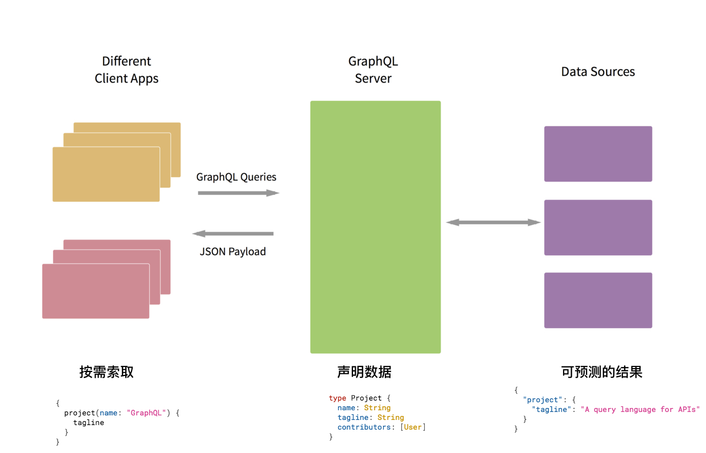

## GraphQL简介

`GraphQL` 是由 `Facebook` 在 `2015` 年创造的用于 `API` 的查询语言。是一个使用基于类型系统来执行查询的服务端运行时（类型系统由你的数据定义）。`GraphQL` 并没有和任何特定数据库或者存储引擎绑定，而是依靠你现有的代码和数据支撑。
一个 `GraphQL` 服务是通过定义类型和类型上的字段来创建的，然后给每个类型上的每个字段提供解析函数。


## 与Rest API对比

经典的 REST 架构模式立足资源，规范了基础的增删改查操作，却未能很好地处理资源之间的关联，及其衍生的一系列接口命名、代码分层等问题。接口名是对于某个逻辑的抽象描述，其往往会关联到某个特定的服务以及特定的多表查询语句，这就导致了接口、服务、SQL 语句与某个逻辑的强耦合性，而无法动态地应对业务逻辑的快速变化。

GraphQL 与之前 Netflix 出品的 Falcor，都是致力于解决相同的问题：如何有效处理日益增长不断变化的 Web/Mobile 端复杂的数据需求。与 REST 相比，GraphQL 为我们提供了声明式(Declarative)、分层可组合的(Hiearchial)、强类型控制(Static Type)的接口声明与交互方式；即保证了单一的查询端点，也提供了更严格、可扩展、可维护的数据查询方式(详见下文-数据模型层)。单一的查询端点能够让开发者免于考虑大量复杂的接口命名，直接使用图查询语言，也能更好地描述资源之间的关系；同时像 GraphiQL 这样的工具也能够帮我们快速生成交互式地接口文档。

GraphQL 本质上是面向消费者的，客户端驱动的开发模式；它允许请求方(即客户端)而非响应方(即服务器端)决定查询的结果格式，从而返回可预测(Predictable)的结果类型，省去了客户端很多的异常情况处理与向后兼容的操作(Backwards Compatible)，提升了产品整体的健壮性。这样确实使得整个请求需要很多额外的数据参数与编码工作，但是它就将消费者与服务端解耦，并且强迫服务端遵守 Postel 法则(对自己严格，对他人宽容)。

不过 GraphQL 并非银弹，其并未缓解业务逻辑本身的复杂度，反而图查询方式在弱化各模块间的耦合的同时带来多次查询的性能损耗，在代码规范、模块划分不当的情况下可能导致渐进式地微服务切分割离也变得麻烦。Graphql 作为前端编写，维护的数据聚合层是非常好的选择，但是小型项目也可以在前端完成自聚合；将服务端的计算查询压力，传导给分布式的，性能日渐强大的客户端，也不失一个选择。REST 与 GraphQL 并非取舍关系，而是渐进融合，REST 项目在自身迭代衍化的过程中也可以不断地借鉴 GraphQL 中的一些思想或者理念，来解决譬如模型分层与界定等问题。

GraphQL的优势：
1. 一次请求多个资源
2. API字段定制化
3. 精确定义返回类型
4. 无需划分版本
5. 类型验证机制
6. 双向通讯

## 基本概念

### 数据类型

GraphQL也有几个基础类型，在GraphQL中他们统称叫标量类型(Scalar Type)

- Int（整型）
- Float（浮点型）
- String（字符串）
- Boolean（布尔型）
- ID（唯一标识符类型）
- 自定义类型 例如：Date类型，只需实现相关的序列化，反序列化和验证的功能即可
- 枚举类型（Enumeration Types）

```bash
enum Episode {
  NEWHOPE
  EMPIRE
  JEDI
}
```
- 接口（Interfaces）

```bash
interface Character {
  id: ID!
  name: String!
  friends: [Character]
  appearsIn: [Episode]!
}
```

- 联合类型（Union Types）

```bash
union SearchResult = Human | Droid | Starship
```

- 输入类型（Input Types）

```bash
input ReviewInput {
  stars: Int!
  commentary: String
}
```

### 操作方法

- Query 查询

```bash
query {
  user(id: 2) {
    id
    name
    age
  }
}
```

- Mutation 新增/编辑/删除

```bash
mutation {
  createUser(name: "Apple", age: 12) {
    id
    name
    age
  }
}
```

- Subscription 订阅


## 实例演示



###

## 延伸拓展

### GraphQL 服务端

- [GraphQL-JS](https://github.com/graphql/graphql-js)  (Node)
它是 GraphQL 的最初的实现。你可以将它和 express-graphql 一起使用，创建你自己的 API 服务 。

- [GraphQL-Server](http://graphql.org/graphql-js/running-an-express-graphql-server/) (Node)
Apollo 团队也有他们自己的一站式 GraphQL 服务端实现。它虽然还没有像 GraphQL-JS 一样被广泛使用，但是它的文档、支持都做得很棒，使用它能快速取得进展。
- [Apollo Server](https://www.apollographql.com/)

### GraphQL 客户端

- [Relay](https://relay.dev/)
Relay 是 Facebook 的 GraphQL 工具。我还没用过它，但是我听说它主要是为了 Facebook 自己的需求量身定做的，可能对大多数的用户来说不是那么人性化。

- [Apollo Client](http://www.apollographql.com/)
Apollo-client，它能让你在浏览器中运行 GraphQL 查询，并存储数据。（它还有自己的开发者插件）。

### GraphQL 工具

- [GraphiQL](https://github.com/graphql/graphiql)
GraphiQL 是一个非常好用的基于浏览器的 IDE，它可以方便你进行 GraphQL 端点查询。

- [DataLoader](https://github.com/facebook/dataloader)
由于 GraphQL 的查询通常是嵌套的，一个查询可能会调用很多个数据库请求。为了避免影响性能，你可以使用一些批量出入库框架和缓存库，例如 Facebook 开发的 DataLoader。

- [Create GraphQL Server](https://blog.hichroma.com/create-graphql-server-instantly-scaffold-a-graphql-server-1ebad1e71840)
Create GraphQL Server 是一个简单的命令行工具，它能快速地帮你搭建好基于 Node 服务端与 Mongo 数据库的 GraphQL 服务端。

### 文档

- [GraphQL中文](https://graphql.cn/)
- [Awesome GraphQL](https://github.com/chentsulin/awesome-graphql)
- [GraphQL Weekly](https://graphqlweekly.com/)

