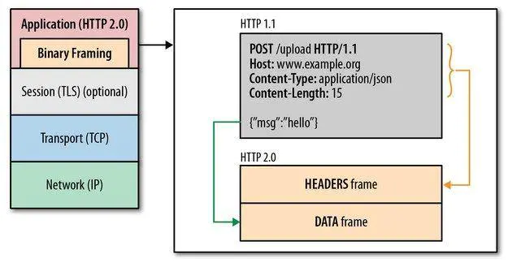
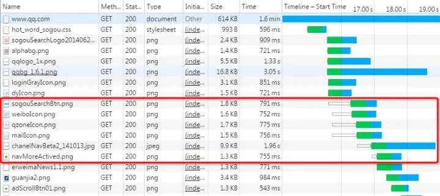
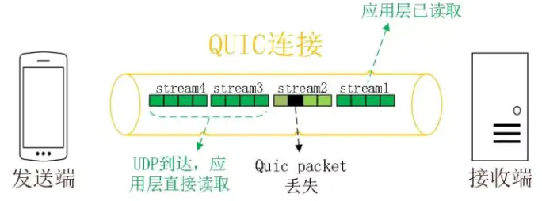
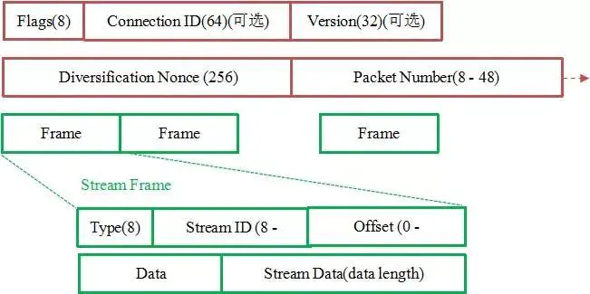

## http/https 协议

HTTP协议是Hyper Text Transfer Protocol（超文本传输协议）的缩写,是用于从万维网（WWW:World Wide Web ）服务器传输超文本到本地浏览器的传送协议。
HTTP基于TCP/IP通信协议来传递数据（HTML 文件, 图片文件, 查询结果等）。
HTTP是一个属于应用层的面向对象的协议，由于其简捷、快速的方式，适用于分布式超媒体信息系统。它于1990年提出，经过几年的使用与发展，得到不断地完善和扩展

### HTTP/0.9

HTTP 的最早版本诞生在 1991 年，这个最早版本和现在比起来极其简单，没有 HTTP 头，没有状态码，甚至版本号也没有，后来它的版本号才被定为 0.9 来和其他版本的 HTTP 区分。HTTP/0.9 只支持一种方法—— Get，请求只有一行。
```js
GET /hello.html
```
响应也是非常简单的，只包含 html 文档本身。
```html
<HTML>
Hello world
</HTML>
```
当 TCP 建立连接之后，服务器向客户端返回 HTML 格式的字符串。发送完毕后，就关闭 TCP 连接。由于没有状态码和错误代码，如果服务器处理的时候发生错误，只会传回一个特殊的包含问题描述信息的 HTML 文件。这就是最早的 HTTP/0.9 版本。


### HTTP/1.0

1996 年，HTTP/1.0 版本发布，大大丰富了 HTTP 的传输内容，除了文字，还可以发送图片、视频等，这为互联网的发展奠定了基础。相比 HTTP/0.9，HTTP/1.0 主要有如下特性：

- 请求与响应支持 HTTP 头，增加了状态码，响应对象的一开始是一个响应状态行
- 协议版本信息需要随着请求一起发送，支持 HEAD，POST 方法
- 支持传输 HTML 文件以外其他类型的内容
- HTTP/1.0 是一种无状态、无连接的应用层协议.

HTTP/1.0规定浏览器和服务器保持短暂的连接，浏览器的每次请求都需要与服务器建立一个TCP连接，服务器处理完成后立即断开TCP连接(无连接)，服务器不跟踪每个客户端也不记录过去的请求(无状态).

> **缺陷**
> - 无法复用连接
> 	每次发送请求的时候，都需要进行一次TCP的连接，而TCP的连接释放过程又是比较费事的。这种无连接的特性会使得网络的利用率非常低。
> - 队头阻塞(Head-Of-Line Blocking)
> 	下个请求必须在前一个请求返回后才能发出，request-response按序发生。显然，如果某个请求长时间没有返回，那么接下来的请求就全部阻塞了。

### HTTP/1.1

在 HTTP/1.0 发布几个月后，HTTP/1.1 就发布了。HTTP/1.1 更多的是作为对 HTTP/1.0 的完善，在 HTTP/1.1 中，主要具有如下改进：

- 长连接
HTTP/1.1增加了一个Connection字段，通过设置Keep-Alive可以保持HTTP连接不断开，避免了每次客户端与服务器请求都要重复建立释放建立TCP连接，提高了网络的利用率。如果客户端想关闭HTTP连接，可以在请求头中携带Connection: false来告知服务器关闭请求。
- 管线化(pipeline)
HTTP 管线化是将多个 HTTP 请求整批提交的技术，而在传送过程中不需先等待服务端的回应。管线化机制须通过永久连接（persistent connection）完成。浏览器将HTTP请求大批提交可大幅缩短页面的加载时间，特别是在传输延迟（lag/latency）较高的情况下。
- chunked 编码传输
该编码将实体分块传送并逐块标明长度,直到长度为 0 块表示传输结束, 这在实体长度未知时特别有用(比如由数据库动态产生的数据)
- 缓存控制
如 etag，cache-control

> **缺陷**
> - 队头阻塞(Head-Of-Line Blocking)
> 	虽然HTTP1.1 引入了pipeling但 pipeling 要求返回是按序的，那么前一个请求如果很耗时(比如处理大图片)，那么后面的请求即使服务器已经处理完，仍会等待前面的请求处理完才开始按序返回。所以，pipeling 只部分解决了 HOLB。
> - 协议开销大
> 	header里携带的内容过大，在一定程度上增加了传输的成本，并且每次请求header基本不怎么变化，尤其在移动端增加用户流量。
> - 传输内容是明文，不够安全
> - keep-alive 给服务端带来性能压力

### HTTP/2.0:
2009年，谷歌公开了自行研发的 SPDY 协议，主要解决HTTP/1.1效率不高的问题。谷歌推出SPDY，才算是正式改造HTTP协议本身。降低延迟，压缩header等等，SPDY的实践证明了这些优化的效果，也最终带来HTTP/2.0的诞生。

SPDY 协议在Chrome浏览器上证明可行以后，就被当作 HTTP/2的基础，主要特性都在 HTTP/2 之中得到继承。

2015年，HTTP/2 发布。HTTP/2是现行HTTP协议（HTTP/1.x）的替代，但它不是重写，HTTP方法/状态码/语义都与HTTP/1.x一样。HTTP/2 基于SPDY3，专注于性能，最大的一个目标是在用户和网站间只用一个连接（connection）

- 二进制传输
在应用层与传输层之间增加一个二进制分帧层，以此达到在不改动 HTTP 的语义，HTTP 方法、状态码、URI 及首部字段的情况下，突破HTTP1.1 的性能限制，改进传输性能，实现低延迟和高吞吐量。在二进制分帧层上，HTTP/2 会将所有传输的信息分割为更小的消息和帧，并对它们采用二进制格式的编码，其中 HTTP1.x 的首部信息会被封装到 Headers 帧，而我们的 request body 则封装到 Data 帧里面。



- 多路复用
代替原来的序列和阻塞机制。所有就是请求的都是通过一个 TCP连接并发完成。 HTTP 1.x 中，如果想并发多个请求，必须使用多个 TCP 链接，且浏览器为了控制资源，还会对单个域名有 6-8个的TCP链接请求限制，如下图，红色圈出来的请求就因域名链接数已超过限制，而被挂起等待了一段时间：



在 HTTP/2 中，有了二进制分帧之后，HTTP/2 不再依赖 TCP 链接去实现多流并行了，在 HTTP/2中：

同域名下所有通信都在单个连接上完成。
单个连接可以承载任意数量的双向数据流。
数据流以消息的形式发送，而消息又由一个或多个帧组成，多个帧之间可以乱序发送，因为根据帧首部的流标识可以重新组装。
这一特性，使性能有了极大提升：

同个域名只需要占用一个 TCP 连接，消除了因多个 TCP 连接而带来的延时和内存消耗。
单个连接上可以并行交错的请求和响应，之间互不干扰。
在HTTP/2中，每个请求都可以带一个31bit的优先值，0表示最高优先级， 数值越大优先级越低。有了这个优先值，客户端和服务器就可以在处理不同的流时采取不同的策略，以最优的方式发送流、消息和帧。
- Header压缩
HTTP/2在客户端和服务器端使用“首部表”来跟踪和存储之前发送的键－值对，对于相同的数据，不再通过每次请求和响应发送；
首部表在HTTP/2的连接存续期内始终存在，由客户端和服务器共同渐进地更新;
每个新的首部键－值对要么被追加到当前表的末尾，要么替换表中之前的值。
- 服务器推送
服务端可以在发送页面HTML时主动推送其它资源，而不用等到浏览器解析到相应位置，发起请求再响应。例如服务端可以主动把JS和CSS文件推送给客户端，而不需要客户端解析HTML时再发送这些请求。

服务端可以主动推送，客户端也有权利选择是否接收。如果服务端推送的资源已经被浏览器缓存过，浏览器可以通过发送RST_STREAM帧来拒收。主动推送也遵守同源策略，服务器不会随便推送第三方资源给客户端。

> **缺陷**
> - 虽然 HTTP/2 解决了很多之前旧版本的问题，但是它还是存在一个巨大的问题，主要是底层支撑的 TCP 协议造成的。
> - 上文提到 HTTP/2 使用了多路复用，一般来说同一域名下只需要使用一个 TCP 连接。但当这个连接中出现了丢包的情况，那就会导致 HTTP/2 的表现情况反倒不如 HTTP/1 了。
> - 因为在出现丢包的情况下，整个 TCP 都要开始等待重传，也就导致了后面的所有数据都被阻塞了。但是对于 HTTP/1.1 来说，可以开启多个 TCP 连接，出现这种情况反到只会影响其中一个连接，剩余的 TCP 连接还可以正常传输数据。
> - 基于这个原因，Google 就更起炉灶搞了一个基于 UDP 协议的 QUIC 协议，并且使用在了 HTTP/3 上

### HTTP/3
HTTP/3 之前名为 HTTP-over-QUIC，从这个名字中我们也可以发现，HTTP/3 最大的改造就是使用了 QUIC。

1. **0-RTT**

通过使用类似 TCP 快速打开的技术，缓存当前会话的上下文，在下次恢复会话的时候，只需要将之前的缓存传递给服务端验证通过就可以进行传输了。0RTT 建连可以说是 QUIC 相比 HTTP2 最大的性能优势。那什么是 0RTT 建连呢？
这里面有两层含义:

传输层 0RTT 就能建立连接。

加密层 0RTT 就能建立加密连接。

2. **多路复用**

同HTTP/2一样，同一条 QUIC连接上可以创建多个stream，来发送多个HTTP请求，但是，QUIC是基于UDP的，一个连接上的多个stream之间没有依赖。比如下图中stream2丢了一个UDP包，不会影响后面跟着 Stream3 和 Stream4，不存在 TCP 队头阻塞。虽然stream2的那个包需要重新传，但是stream3、stream4的包无需等待，就可以发给用户。



3. **加密认证的报文**

TCP 协议头部没有经过任何加密和认证，所以在传输过程中很容易被中间网络设备篡改，注入和窃听。比如修改序列号、滑动窗口。这些行为有可能是出于性能优化，也有可能是主动攻击。

但是 QUIC 的 packet 可以说是武装到了牙齿。除了个别报文比如 PUBLIC_RESET 和 CHLO，所有报文头部都是经过认证的，报文 Body 都是经过加密的。

这样只要对 QUIC 报文任何修改，接收端都能够及时发现，有效地降低了安全风险。

如下图所示，红色部分是 Stream Frame 的报文头部，有认证。绿色部分是报文内容，全部经过加密。



4. **连接迁移**

一条 TCP 连接是由四元组标识的（源 IP，源端口，目的 IP，目的端口）。什么叫连接迁移呢？就是当其中任何一个元素发生变化时，这条连接依然维持着，能够保持业务逻辑不中断。当然这里面主要关注的是客户端的变化，因为客户端不可控并且网络环境经常发生变化，而服务端的 IP 和端口一般都是固定的。
针对 TCP 的连接变化，MPTCP其实已经有了解决方案，但是由于 MPTCP 需要操作系统及网络协议栈支持，部署阻力非常大，目前并不适用。

那 QUIC 是如何做到连接迁移呢？很简单，任何一条 QUIC 连接不再以 IP 及端口四元组标识，而是以一个 64 位的随机数作为 ID 来标识，这样就算 IP 或者端口发生变化时，只要 ID 不变，这条连接依然维持着，上层业务逻辑感知不到变化，不会中断，也就不需要重连。

由于这个 ID 是客户端随机产生的，并且长度有 64 位，所以冲突概率非常低。

5. **向前冗余纠错**

每个数据包除了它本身的内容之外，还包括了部分其他数据包的数据，因此少量的丢包可以通过其他包的冗余数据直接组装而无需重传。向前纠错牺牲了每个数据包可以发送数据的上限，但是减少了因为丢包导致的数据重传，因为数据重传将会消耗更多的时间(包括确认数据包丢失、请求重传、等待新数据包等步骤的时间消耗)

假如说这次我要发送三个包，那么协议会算出这三个包的异或值并单独发出一个校验包，也就是总共发出了四个包。当出现其中的非校验包丢包的情况时，可以通过另外三个包计算出丢失的数据包的内容。当然这种技术只能使用在丢失一个包的情况下，如果出现丢失多个包就不能使用纠错机制了，只能使用重传的方式了。


### https

较为安全的网络传输协议
- 证书(公钥)
- SSL 加密
- 端口 443


参考：
[HTTP的发展史--从1.0到3.0都经历了什么](https://www.jianshu.com/p/1d39fd9f1917)
[https连接的前几毫秒发生了什么](https://www.rrfed.com/2017/02/03/https/)
[从Chrome源码看HTTPS](https://www.rrfed.com/2018/02/26/chrome-https/)

## TCP/UDP协议

- TCP:
	- 三次握手
	- 四次挥手
	- 滑动窗口: 流量控制
	- 拥塞处理
		- 慢开始
		- 拥塞避免
		- 快速重传
		- 快速恢复 

[作为前端的你了解多少tcp的内](https://juejin.im/post/5c078058f265da611c26c235)

### 2. 常见状态码

- 1xx: 接受，继续处理 
- 200: 成功，并返回数据
- 201: 已创建
- 202: 已接受
- 203: 成为，但未授权
- 204: 成功，无内容
- 205: 成功，重置内容
- 206: 成功，部分内容
- 301: 永久移动，重定向
- 302: 临时移动，可使用原有URI
- 304: 资源未修改，可使用缓存
- 305: 需代理访问
- 400: 请求语法错误
- 401: 要求身份认证
- 403: 拒绝请求
- 404: 资源不存在
- 500: 服务器错误

### 3. get / post

- get: 缓存、请求长度受限、会被历史保存记录
	- 无副作用(不修改资源)，幂等(请求次数与资源无关)的场景 
- post: 安全、大数据、更多编码类型

两者详细对比如下图:


### 4. Websocket

Websocket 是一个 **持久化的协议**， 基于 http ， 服务端可以 **主动 push**

- 兼容：
	- FLASH Socket
	- 长轮询： 定时发送 ajax
	- long poll： 发送 --> 有消息时再 response

- `new WebSocket(url)`
- `ws.onerror = fn`
- `ws.onclose = fn`
- `ws.onopen = fn`
- `ws.onmessage = fn`
- `ws.send()`

### 5. TCP三次握手

建立连接前，客户端和服务端需要通过握手来确认对方:

- 客户端发送 syn(同步序列编号) 请求，进入 syn_send 状态，等待确认
- 服务端接收并确认 syn 包后发送 syn+ack 包，进入 syn_recv 状态
- 客户端接收 syn+ack 包后，发送 ack 包，双方进入 established 状态

### 6. TCP四次挥手

- 客户端 -- FIN --> 服务端， FIN—WAIT
- 服务端 -- ACK --> 客户端， CLOSE-WAIT
- 服务端 -- ACK,FIN --> 客户端， LAST-ACK
- 客户端 -- ACK --> 服务端，CLOSED

### 7. Node 的 Event Loop: 6个阶段

- timer 阶段: 执行到期的`setTimeout / setInterval`队列回调
- I/O 阶段: 执行上轮循环残流的`callback`
- idle, prepare
- poll: 等待回调
	- 1. 执行回调
	- 2. 执行定时器
		- 如有到期的`setTimeout / setInterval`， 则返回 timer 阶段
		- 如有`setImmediate`，则前往 check 阶段
- check
	- 执行`setImmediate`
- close callbacks

### 跨域

- JSONP: 利用`<script>`标签不受跨域限制的特点，缺点是只能支持 get 请求 

```js
function jsonp(url, jsonpCallback, success) {
  const script = document.createElement('script')
  script.src = url
  script.async = true
  script.type = 'text/javascript'
  window[jsonpCallback] = function(data) {
    success && success(data)
  }
  document.body.appendChild(script)
}
```

- 设置 CORS: Access-Control-Allow-Origin：*
- postMessage

### 安全

- XSS攻击: 注入恶意代码
	- cookie 设置 httpOnly
	- 转义页面上的输入内容和输出内容 
- CSRF: 跨站请求伪造，防护:
	- get 不修改数据
	- 不被第三方网站访问到用户的 cookie
	- 设置白名单，不被第三方网站请求
	- 请求校验 