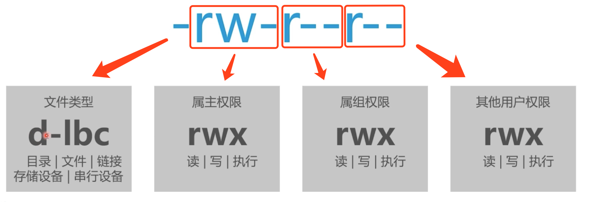

### linux目录结构


### linux常用命令(命令查询: http://man.linuxde.net/)
#### ssh远程登录：ssh

#### 新建文件或目录：touch/mkdir
* 实例

创建一个hello.txt文件
```
touch hello.txt
```
创建一个myproject目录
```
mkdir myproject
```

#### 写入文件：echo
* 实例

在hello.txt中写入Thanks
```
echo Thanks > hello.txt
```

#### 查看文件内容：cat
* 实例

查看hello.txt中的内容
```
cat hello.txt
// Thanks
```

#### 复制文件或目录：cp
* 实例

复制文件hello.txt,新文件为new.txt
```
cp hello.txt new.txt

ls
// hello.txt new.txt
```
复制目录myproject,新目录为newproject
```
cp -r myproject newproject

// -r 递归复制目录的内容
```

#### 删除文件或目录：rm
* 实例

删除文件hello.txt
```
cp hello.txt new.txt

ls
// new.txt
```
删除目录myproject
```
rm -r myproject

ls
// newproject
// -r 递归删除目录的内容

rm -rf myproject
// -rf 递归删除目录的内容，不给出提示。
```

#### 移动文件或目录：mv
* 实例

移动目录newproject到home目录下
```
mv -f newproject /home

cd home 
ls
// newproject
// -f 强制覆盖已存在的目录或文件
```

#### 查看文件及目录属性：ls
* 实例

查看当前目录下所有文件及目录的属性
```
ls -l

// drwxr-xr-x  root root 7 Apr 8 14:39 myproject
// -rw-r--r--  root root 7 Apr 8 14:39 hello.txt
```

#### 修改文件及目录权限：chmod
* 实例

修改当前文件及目录权限
```
chmod 700

// 读对应权限4  写对应权限2 执行对应权限是1 没有权限对应是0
// 700 的百位是属主权限，十位是属组权限，个位是其他用户权限（7表示读、写、执行权限 4+2+1）
```

