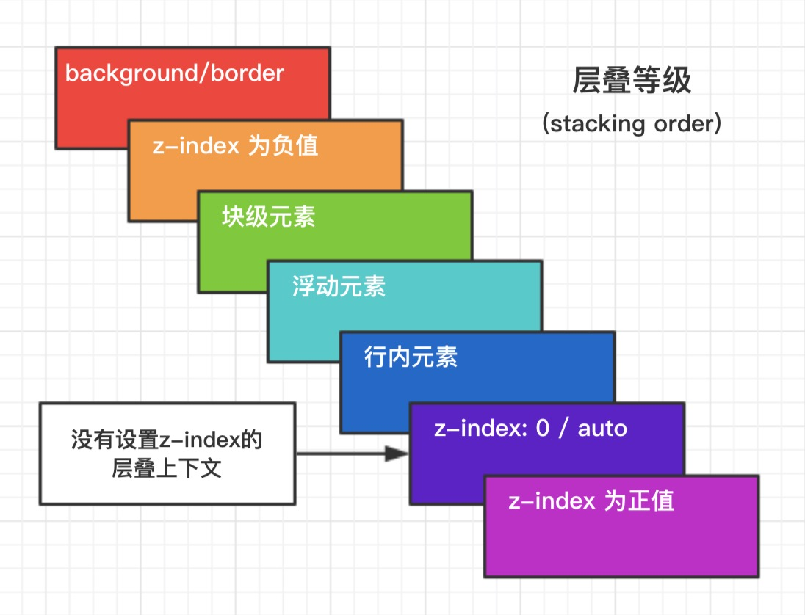

## CSS 基础

### 选择器优先级

- `!important` > 行内样式 > `#id` > `.class` > `tag` > \* > 继承 > 默认
- 选择器 **从右往左** 解析

### link 与 @import 的区别

- `link`功能较多，可以定义 RSS，定义 Rel 等作用，而`@import`只能用于加载 css
- 当解析到`link`时，页面会同步加载所引的 css，而`@import`所引用的 css 会等到页面加载完才被加载
- `@import`需要 IE5 以上才能使用
- `link`可以使用 js 动态引入，`@import`不行

### 盒模型

页面渲染时，dom 元素所采用的 **布局模型**。可通过`box-sizing`进行设置。根据计算宽高的区域可分为：

- `content-box` (W3C 标准盒模型)
- `border-box` (IE 盒模型)
- `padding-box`
- `margin-box` (浏览器未实现)

### 定位

- static;(默认值，没有定位，出现在正常的文档流中，忽略 top，left，right，bottom，z-index 的声明)
- relative（生成相对定位的元素，通过 left，right，top，bottom 的设置，相对于正常位置进行定位，可通过 z-index 进行层次分级）（relative 总是相对于最近的父元素，无论其父元素是何种定位方式）
- absolute（生成绝对定位的元素，相对于 static 定位以外的第一个父元素定位，元素的位置可通过 left，right，top，bottom 的设置，可根据 z-index 进行层次分级）（absolute 定位的层总是相对于其最近的定义为 absolute 或 relative 的父层）
- fixed（生成绝对定位的元素，相对于浏览器窗口进行定位，元素的位置可以根据 left，right，top，bottom 进行规定，可通过 z-index 进行层级分级）
- sticky （生成粘性定位的元素，可以被认为是 relative 和 fixed 的混合，元素在跨越特定 top、right、bottom、left 阈值前为相对定位，之后为固定定位）

### overflow

- visible	默认值。内容不会被修剪，会呈现在元素框之外。
- hidden	内容会被修剪，并且其余内容是不可见的。
- scroll	内容会被修剪，但是浏览器会显示滚动条以便查看其余的内容。
- auto	如果内容被修剪，则浏览器会显示滚动条以便查看其余的内容。
- inherit	规定应该从父元素继承 overflow 属性的值。

auto：可能会影响fix,但是hidden不会
auto：可以手动滑动页面，hidden：不能手动滑动页面

### inline/block/inline-block
block
块级元素特点：
1、每个块级元素都从新的一行开始，并且其后的元素也另起一行。（很霸道，一个块级元素独占一行）
2、元素的高度、宽度、行高以及顶和底边距都可设置。
3、元素宽度在不设置的情况下，是它本身父容器的100%（和父元素的宽度一致），除非设定一个宽度。

inline
内联元素特点：
1、和其他元素都在一行上；
2、元素的高度、宽度及顶部和底部边距不可设置；
3、元素的宽度就是它包含的文字或图片的宽度，不可改变。

inline-block
内联块状元素（inline-block）就是同时具备内联元素、块状元素的特点。
inline-block 元素特点：
1、和其他元素都在一行上；
2、元素的高度、宽度、行高以及顶和底边距都可设置

常见的inline内联元素：
span、img、a、lable、input、abbr（缩写）、em（强调）、big、cite（引用）、i（斜体）、q（短引用）、textarea、select、small、sub、sup，strong、u（下划线）、button（默认display：inline-block））

常见的block块级元素：
div、p、h1…h6、ol、ul、dl、table、address、blockquote、form

常见的inline-block内联块元素：
img、input

## 格式化上下文（Formatting Contexts）

W3C CSS2.1 规范中的一个概念。它是页面中的一块渲染区域，并且有一套渲染规则，它决定了其子元素将如何定位，以及和其他元素的关系和相互作用。

### BFC

**块级格式化上下文**，是一个独立的渲染区域，让处于 BFC 内部的元素与外部的元素相互隔离，使内外元素的定位不会相互影响。

> IE 下为 Layout，可通过 zoom:1 触发

- 触发条件: - 根元素 - `position: absolute/fixed` - `display: inline-block / table` - `float` 元素 - `ovevflow` !== `visible`
- 规则: - 属于同一个 BFC 的两个相邻 Box 垂直排列 - 属于同一个 BFC 的两个相邻 Box 的 margin 会发生重叠 - BFC 中子元素的 margin box 的左边， 与包含块 (BFC) border box 的左边相接触 (子元素 absolute 除外) - BFC 的区域不会与 float 的元素区域重叠 - 计算 BFC 的高度时，浮动子元素也参与计算 - 文字层不会被浮动层覆盖，环绕于周围

- 应用: - 阻止`margin`重叠 - 可以包含浮动元素 —— 清除内部浮动(清除浮动的原理是两个`div`都位于同一个 BFC 区域之中) - 自适应两栏布局 - 可以阻止元素被浮动元素覆盖

### IFC

IFC(Inline Formatting Contexts)直译为"内联格式化上下文"，IFC 的 line box（线框）高度由其包含行内元素中最高的实际高度计算而来（不受到竖直方向的 padding/margin 影响)
IFC 中的 line box 一般左右都贴紧整个 IFC，但是会因为 float 元素而扰乱。float 元素会位于 IFC 与与 line box 之间，使得 line box 宽度缩短。 同个 ifc 下的多个 line box 高度会不同。 IFC 中时不可能有块级元素的，当插入块级元素时（如 p 中插入 div）会产生两个匿名块与 div 分隔开，即产生两个 IFC，每个 IFC 对外表现为块级元素，与 div 垂直排列。
那么 IFC 一般有什么用呢？
水平居中：当一个块要在环境中水平居中时，设置其为 inline-block 则会在外层产生 IFC，通过 text-align 则可以使其水平居中。
垂直居中：创建一个 IFC，用其中一个元素撑开父元素的高度，然后设置其 vertical-align:middle，其他行内元素则可以在此父元素下垂直居中。

### GFC

GFC(GridLayout Formatting Contexts)直译为"网格布局格式化上下文"，当为一个元素设置 display 值为 grid 的时候，此元素将会获得一个独立的渲染区域，我们可以通过在网格容器（grid container）上定义网格定义行（grid definition rows）和网格定义列（grid definition columns）属性各在网格项目（grid item）上定义网格行（grid row）和网格列（grid columns）为每一个网格项目（grid item）定义位置和空间。
那么 GFC 有什么用呢，和 table 又有什么区别呢？首先同样是一个二维的表格，但 GridLayout 会有更加丰富的属性来控制行列，控制对齐以及更为精细的渲染语义和控制。

### FFC

FFC(Flex Formatting Contexts)直译为"自适应格式化上下文"，display 值为 flex 或者 inline-flex 的元素将会生成自适应容器（flex container），可惜这个牛逼的属性只有谷歌和火狐支持，不过在移动端也足够了，至少 safari 和 chrome 还是 OK 的，毕竟这俩在移动端才是王道。
Flex Box 由伸缩容器和伸缩项目组成。通过设置元素的 display 属性为 flex 或 inline-flex 可以得到一个伸缩容器。设置为 flex 的容器被渲染为一个块级元素，而设置为 inline-flex 的容器则渲染为一个行内元素。
伸缩容器中的每一个子元素都是一个伸缩项目。伸缩项目可以是任意数量的。伸缩容器外和伸缩项目内的一切元素都不受影响。简单地说，Flexbox 定义了伸缩容器内伸缩项目该如何布局。

### 层叠上下文

元素提升为一个比较特殊的图层，在三维空间中 **(z 轴)** 高出普通元素一等。

- 触发条件 - 根层叠上下文(`html`) - `position` - css3 属性 - `flex` - `transform` - `opacity` - `filter` - `will-change` - `-webkit-overflow-scrolling`

- 层叠等级：层叠上下文在 z 轴上的排序 - 在同一层叠上下文中，层叠等级才有意义 - `z-index`的优先级最高

## 常用设置

### 居中布局

- 水平居中 - 行内元素: `text-align: center` - 块级元素: `margin: 0 auto` - `absolute + transform` - `flex + justify-content: center`
- 垂直居中 - `line-height: height` - `absolute + transform` - `flex + align-items: center` - `table`
- 水平垂直居中 - `absolute + transform` - `flex + justify-content + align-items`

### 去除浮动影响，防止父级高度塌陷

- 通过增加尾元素清除浮动 - `:after /   : clear: both`
- 创建父级 BFC
- 父级设置高度

### 比较 `opacity: 0`、`visibility: hidden`、`display: none` 优劣和适用场景

结构：
- `display:none`: 会让元素完全从渲染树中消失，渲染的时候不占据任何空间, 不能点击，
- `visibility: hidden`:不会让元素从渲染树消失，渲染元素继续占据空间，只是内容不可见，不能点击
- `opacity: 0`: 不会让元素从渲染树消失，渲染元素继续占据空间，只是内容不可见，可以点击

继承：
- `display: none`和`opacity: 0`：是非继承属性，子孙节点消失由于元素从渲染树消失造成，通过修改子孙节点属性无法显示。
- `visibility: hidden`：是继承属性，子孙节点消失由于继承了`hidden`，通过设置`visibility: visible`;可以让子孙节点显式。

性能：
- `display: none` : 修改元素会造成文档回流,读屏器不会读取`display: none`元素内容，性能消耗较大
- `visibility:hidden`: 修改元素只会造成本元素的重绘,性能消耗较少读屏器读取,
- `opacity: 0`： 修改元素会造成重绘，性能消耗较少

联系：
它们都能让元素不可见

## CSS 预处理器(Sass/Less/Postcss)

CSS 预处理器的原理: 是将类 CSS 语言通过 **Webpack 编译** 转成浏览器可读的真正 CSS。在这层编译之上，便可以赋予 CSS 更多更强大的功能，常用功能:

- 嵌套
- 变量
- 循环语句
- 条件语句
- 自动前缀
- 单位转换
- mixin 复用

面试中一般不会重点考察该点，一般介绍下自己在实战项目中的经验即可~

## CSS 动画

- `transition`: 过渡动画 - `transition-property`: 属性 - `transition-duration`: 间隔 - `transition-timing-function`: 曲线 - `transition-delay`: 延迟 - 常用钩子: `transitionend`

- `animation / keyframes` - `animation-name`: 动画名称，对应`@keyframes` - `animation-duration`: 间隔 - `animation-timing-function`: 曲线 - `animation-delay`: 延迟 - `animation-iteration-count`: 次数 - `infinite`: 循环动画 - `animation-direction`: 方向 - `alternate`: 反向播放 - `animation-fill-mode`: 静止模式 - `forwards`: 停止时，保留最后一帧 - `backwards`: 停止时，回到第一帧 - `both`: 同时运用 `forwards / backwards` - 常用钩子: `animationend`
- 动画属性: 尽量使用动画属性进行动画，能拥有较好的性能表现 - `translate` - `scale` - `rotate` - `skew` - `opacity` - `color`

## 其他

### 渐进增强和优雅降级

渐进增强（progressive enhancement）：针对低版本浏览器进行构建页面，保证最基本的功能，然后再针对高级浏览器进行效果、交互等改进和追加功能达到更好的用户体验。（从被所有浏览器支持的基本功能开始，逐步地添加那些只有新式浏览器才支持的功能，向页面添加无害于基础浏览器的额外样式和功能。当浏览器支持时，它们会自动地呈现出来并发挥作用。）

优雅降级（graceful degradation）：一开始就构建完整的功能，然后再针对低版本浏览器进行兼容。（Web站点在所有新式浏览器中都能正常工作，如果用户使用的是老式浏览器，则代码会检查以确认它们是否能正常工作。由于IE独特的盒模型布局问题，针对不同版本的IE的hack实践过优雅降级了，为那些无法支持功能的浏览器增加候选方案，使之在旧式浏览器上以某种形式降级体验却不至于完全失效。）

区别：优雅降级是从复杂的现状开始，并试图减少用户体验的供给，而渐进增强则是从一个非常基础的、能够起作用的版本开始，并不断扩充，以适应未来环境的需要。

渐进增强观点：

渐进增强观点认为应该关注于内容本身。内容是我们建立网站的诱因，有的网站展示它，有的则收集它，有的寻求、有的操作，还有的网站甚至包含以上的种种，但相同点是他们全都涉及到内容，这使得“渐进增强”成为一种更为合理的设计范例。这也是它立即被Yahoo!所采纳并用以构建其“分级式浏览器支持（Graded Browser Support)“策略的原因所在。

 

优雅降级观点：

优雅降级观点认为应该针对那些最高级、最完善的浏览器来设计网站。而将那些被认为“过时”或有功能缺失的浏览器下的测试工作安排在开发周期的最后阶段，并把测试对象限定为主流浏览器（如IE、Mozilla等）的前一个版本。

在这种设计范例下，旧版的浏览器被认为仅能提供“简陋却无妨（poor,but passable)”的浏览体验。你可以做一些小的调整来适应某个特定的浏览器。但由于它们并非我们所关注的焦点，因此除了修复较大的错误之外，其它的差异将被直接忽略。

参考
[BFC、IFC、GFC 和 FFC](https://www.cnblogs.com/dingyufenglian/p/4845477.html)
