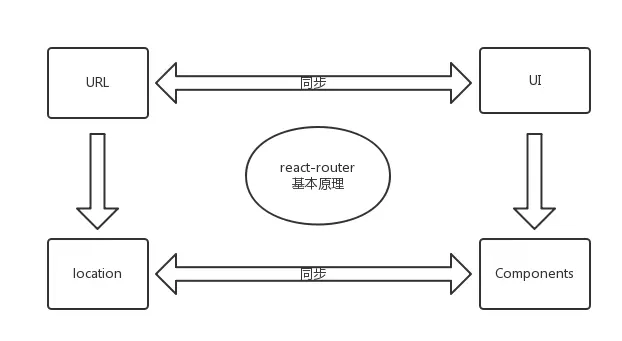
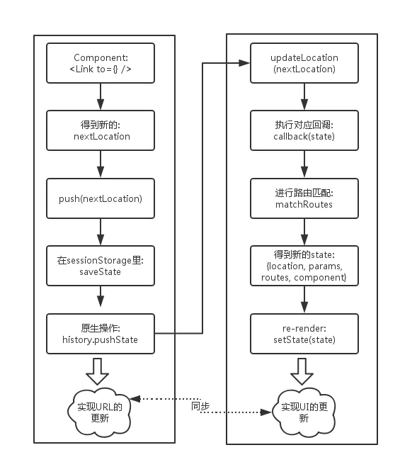
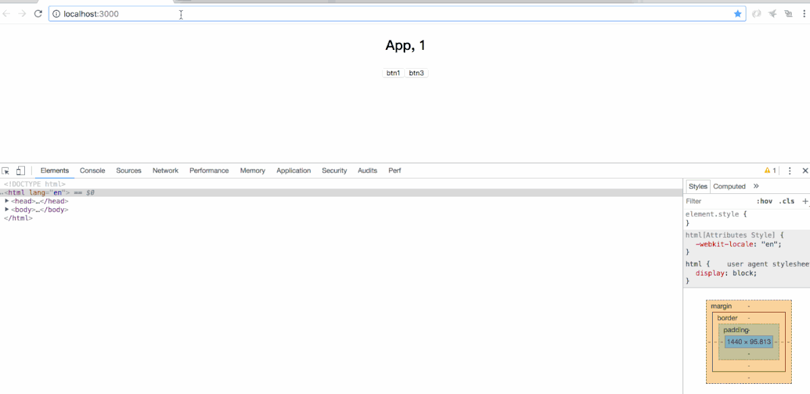

**React**

`React` 也是现如今最流行的前端框架，也是很多大厂面试必备。`React` 与 `Vue` 虽有不同，但同样作为一款 `UI` 框架，虽然实现可能不一样，但在一些理念上还是有相似的，例如数据驱动、组件化、虚拟 `dom` 等。这里就主要列举一些 React 中独有的概念。

## 架构

### Fiber

React16 提出了 Fiber 结构，其能够将任务分片，划分优先级，同时能够实现类似于操作系统中对线程的抢占式调度，非常强大。

React 的核心流程可以分为两个部分:

- reconciliation (**调度算法**，也可称为 render):
  - 更新 state 与 props；
  - 调用生命周期钩子；
  - 生成 virtual dom；
  - 通过新旧 vdom 进行 diff 算法，获取 vdom change；
  - 确定是否需要重新渲染
- commit:
  - 如需要，则操作 dom 节点更新；

要了解 Fiber，我们首先来看为什么需要它？

- **问题**: 随着应用变得越来越庞大，整个更新渲染的过程开始变得吃力，大量的组件渲染会导致主进程长时间被占用，导致一些动画或高频操作出现卡顿和掉帧的情况。而关键点，便是 **同步阻塞**。在之前的调度算法中，React 需要实例化每个类组件，生成一颗组件树，使用 **同步递归** 的方式进行遍历渲染，而这个过程最大的问题就是无法 **暂停和恢复**。

- **解决方案**: 解决同步阻塞的方法，通常有两种: **异步** 与 **任务分割**。而 React Fiber 便是为了实现任务分割而诞生的。

- **简述**:

  - 在 React V16 将调度算法进行了重构， 将之前的 stack reconciler 重构成新版的 fiber reconciler，变成了具有链表和指针的 **单链表树遍历算法**。通过指针映射，每个单元都记录着遍历当下的上一步与下一步，从而使遍历变得可以被暂停和重启。
  - 这里我理解为是一种 **任务分割调度算法**，主要是 将原先同步更新渲染的任务分割成一个个独立的 **小任务单位**，根据不同的优先级，将小任务分散到浏览器的空闲时间执行，充分利用主进程的事件循环机制。

- **核心**:

  - Fiber 这里可以具象为一个 **数据结构**:

  ```js
  class Fiber {
    constructor(instance) {
      this.instance = instance;
      // 指向第一个 child 节点
      this.child = child;
      // 指向父节点
      this.return = parent;
      // 指向第一个兄弟节点
      this.sibling = previous;
    }
  }
  ```

  - **链表树遍历算法**: 通过 **节点保存与映射**，便能够随时地进行 停止和重启，这样便能达到实现任务分割的基本前提；

    - 1、首先通过不断遍历子节点，到树末尾；
    - 2、开始通过 sibling 遍历兄弟节点；
    - 3、return 返回父节点，继续执行 2；
    - 4、直到 root 节点后，跳出遍历；

  - **任务分割**，React 中的渲染更新可以分成两个阶段:

    - **reconciliation 阶段**: vdom 的数据对比，是个适合拆分的阶段，比如对比一部分树后，先暂停执行个动画调用，待完成后再回来继续比对。
    - **Commit 阶段**: 将 change list 更新到 dom 上，不适合拆分，因为使用 vdom 的意义就是为了节省传说中最耗时的 dom 操作，把所有操作一次性更新，如果在这里又拆分，那不是又懵了么。🙃

  - **分散执行**: 任务分割后，就可以把小任务单元分散到浏览器的空闲期间去排队执行，而实现的关键是两个新 API: `requestIdleCallback` 与 `requestAnimationFrame`
    - 低优先级的任务交给`requestIdleCallback`处理，这是个浏览器提供的事件循环空闲期的回调函数，需要 pollyfill，而且拥有 deadline 参数，限制执行事件，以继续切分任务；
    - 高优先级的任务交给`requestAnimationFrame`处理；

  ```js
  // 类似于这样的方式
  requestIdleCallback((deadline) => {
    // 当有空闲时间时，我们执行一个组件渲染；
    // 把任务塞到一个个碎片时间中去；
    while (
      (deadline.timeRemaining() > 0 || deadline.didTimeout) &&
      nextComponent
    ) {
      nextComponent = performWork(nextComponent);
    }
  });
  ```

  - **优先级策略**: 文本框输入 > 本次调度结束需完成的任务 > 动画过渡 > 交互反馈 > 数据更新 > 不会显示但以防将来会显示的任务

> Tips:
>
> Fiber 其实可以算是一种编程思想，在其它语言中也有许多应用(Ruby Fiber)。当遇到进程阻塞的问题时，**任务分割**、**异步调用** 和 **缓存策略** 是三个显著的解决思路。

### Virtual DOM

虽然DOM是由JavaScript实现的，但是在浏览器中都是把DOM和JavaScript分开来实现的，比如IE中，JavaScript的实现名为JScript，放在jscript.dll文件中，而DOM则放在另一个叫做mshtml.dll的库中。在Safari中，DOM和渲染是使用Webkit中的WebCore实现，而JavaScript是由独立的JavaScriptCore引擎实现，同样在Chrome中，同样是使用WebCore来实现渲染，而JavaScript引擎则是他们自己研发的V8引擎。

由于DOM和JavaScript是被分开独立实现的，因此，每一次在通过js操作DOM的时候，就需要先去连接js和DOM，我们可以这样理解：把DOM和JavaScript比作两个岛，他们之间通过一个收费的桥连接着，每一次访问DOM的时候，就需要经过这座桥，并且给“过路费”，访问的次数越多，路费就会越高，并且访问到DOM后，操作具体的DOM还需要给“操作费”，由于浏览器访问DOM的操作很多，因此，“路费”和“操作费”自然会增加，这就是为什么操作DOM会很慢的原因

## 生命周期

在新版本中，React 官方对生命周期有了新的 **变动建议**:

- 使用`getDerivedStateFromProps` 替换`componentWillMount`；
- 使用`getSnapshotBeforeUpdate`替换`componentWillUpdate`；
- 避免使用`componentWillReceiveProps`；

其实该变动的原因，正是由于上述提到的 Fiber。首先，从上面我们知道 React 可以分成 reconciliation 与 commit 两个阶段，对应的生命周期如下:

- **reconciliation**:

  - `componentWillMount`
  - `componentWillReceiveProps`
  - `shouldComponentUpdate`
  - `componentWillUpdate`

- **commit**:
  - `componentDidMount`
  - `componentDidUpdate`
  - `componentWillUnmount`

在 Fiber 中，reconciliation 阶段进行了任务分割，涉及到 暂停 和 重启，因此可能会导致 reconciliation 中的生命周期函数在一次更新渲染循环中被 **多次调用** 的情况，产生一些意外错误。

新版的建议生命周期如下:

```js
class Component extends React.Component {
  // 替换 `componentWillReceiveProps` ，
  // 初始化和 update 时被调用
  // 静态函数，无法使用 this
  static getDerivedStateFromProps(nextProps, prevState) {}

  // 判断是否需要更新组件
  // 可以用于组件性能优化
  shouldComponentUpdate(nextProps, nextState) {}

  // 组件被挂载后触发
  componentDidMount() {}

  // 替换 componentWillUpdate
  // 可以在更新之前获取最新 dom 数据
  getSnapshotBeforeUpdate() {}

  // 组件更新后调用
  componentDidUpdate() {}

  // 组件即将销毁
  componentWillUnmount() {}

  // 组件已销毁
  componentDidUnMount() {}
}
```

- **使用建议**:

  - 在`constructor`初始化 state；
  - 在`componentDidMount`中进行事件监听，并在`componentWillUnmount`中解绑事件；
  - 在`componentDidMount`中进行数据的请求，而不是在`componentWillMount`；
  - 需要根据 props 更新 state 时，使用`getDerivedStateFromProps(nextProps, prevState)`；
    - 旧 props 需要自己存储，以便比较；

  ```js
  public static getDerivedStateFromProps(nextProps, prevState) {
    // 当新 props 中的 data 发生变化时，同步更新到 state 上
    if (nextProps.data !== prevState.data) {
      return {
        data: nextProps.data
      }
    } else {
      return null1
    }
    }
  ```

  - 可以在`componentDidUpdate`监听 props 或者 state 的变化，例如:

  ```js
  componentDidUpdate(prevProps) {
    // 当 id 发生变化时，重新获取数据
    if (this.props.id !== prevProps.id) {
      this.fetchData(this.props.id);
    }
  }
  ```

  - 在`componentDidUpdate`使用`setState`时，必须加条件，否则将进入死循环；
  - `getSnapshotBeforeUpdate(prevProps, prevState)`可以在更新之前获取最新的渲染数据，它的调用是在 render 之后， mounted 之前；
  - `shouldComponentUpdate`: 默认每次调用`setState`，一定会最终走到 diff 阶段，但可以通过`shouldComponentUpdate`的生命钩子返回`false`来直接阻止后面的逻辑执行，通常是用于做条件渲染，优化渲染的性能。

## 渲染机制

### key

> key 是给每一个 vnode 的唯一 id,可以依靠 key,更准确, 更快的拿到 oldVnode 中对应的 vnode 节点。

1. 更准确
   因为带 key 就不是就地复用了，在 sameNode 函数 a.key === b.key 对比中可以避免就地复用的情况。所以会更加准确。

2. 更快
   利用 key 的唯一性生成 map 对象来获取对应节点，比遍历方式更快。(这个观点，就是我最初的那个观点。从这个角度看，map 会比遍历更快。)

### setState

在了解`setState`之前，我们先来简单了解下 React 一个包装结构: **Transaction**:

- **事务** (Transaction):
  - 是 React 中的一个调用结构，用于包装一个方法，结构为: **initialize - perform(method) - close**。通过事务，可以统一管理一个方法的开始与结束；处于事务流中，表示进程正在执行一些操作；


- `setState`: React 中用于修改状态，更新视图。它具有以下特点:

- **异步与同步**: `setState`并不是单纯的异步或同步，这其实与调用时的环境相关:

  - 在 **合成事件** 和 **生命周期钩子(除 componentDidUpdate)** 中，`setState`是"异步"的；
    - **原因**: 因为在`setState`的实现中，有一个判断: 当更新策略正在事务流的执行中时，该组件更新会被推入`dirtyComponents`队列中等待执行；否则，开始执行`batchedUpdates`队列更新；
      - 在生命周期钩子调用中，更新策略都处于更新之前，组件仍处于事务流中，而`componentDidUpdate`是在更新之后，此时组件已经不在事务流中了，因此则会同步执行；
      - 在合成事件中，React 是基于 **事务流完成的事件委托机制** 实现，也是处于事务流中；
    - **问题**: 无法在`setState`后马上从`this.state`上获取更新后的值。
    - **解决**: 如果需要马上同步去获取新值，`setState`其实是可以传入第二个参数的。`setState(updater, callback)`，在回调中即可获取最新值；
  - 在 **原生事件** 和 **setTimeout** 中，`setState`是同步的，可以马上获取更新后的值；
    - 原因: 原生事件是浏览器本身的实现，与事务流无关，自然是同步；而`setTimeout`是放置于定时器线程中延后执行，此时事务流已结束，因此也是同步；

- **批量更新**: 在 **合成事件** 和 **生命周期钩子** 中，`setState`更新队列时，存储的是 **合并状态**(`Object.assign`)。因此前面设置的 key 值会被后面所覆盖，最终只会执行一次更新；

- **函数式**: 由于 Fiber 及 合并 的问题，官方推荐可以传入 **函数** 的形式。`setState(fn)`，在`fn`中返回新的`state`对象即可，例如`this.state((state, props) => newState)；`

  - 使用函数式，可以用于避免`setState`的批量更新的逻辑，传入的函数将会被 **顺序调用**；

- **注意事项**:
  - setState 合并，在 合成事件 和 生命周期钩子 中多次连续调用会被优化为一次；
  - 当组件已被销毁，如果再次调用`setState`，React 会报错警告，通常有两种解决办法:
    - 将数据挂载到外部，通过 props 传入，如放到 Redux 或 父级中；
    - 在组件内部维护一个状态量 (isUnmounted)，`componentWillUnmount`中标记为 true，在`setState`前进行判断；

### forceUpdate

强制React组件渲染的方法有多种，但本质上是相同的。 首先是使用this.forceUpdate() ，它会跳过shouldComponentUpdate

```js
someMethod() {
  // Force a render without state change...
  this.forceUpdate();
}
```

## 事件机制

- React事件是合成事件
- 有stopPropagation和preventDefault
- 有nativeEvent上的所有属性
- 可以通过nativeEvent获取到原生事件
- 跨浏览器兼容

### 事件代理

首先回顾以下原生事件的两个方法：`event.stopImmediatePropagation` 和 `event.stopPropagation` ，前者可以阻止同一 dom 上的后续事件的执行以及阻止冒泡，后者仅能阻止冒泡。

在 react 内通过 onClick 绑定的事件，实际上并没有把点击事件绑定到对应的元素上，而是统一放到了 document 上处理。点击一个元素，首先触发这个元素的原生绑定事件（这里不讨论捕获），接着事件冒泡，到了 document 上，先触发 dispatch，即分发 react 的合成事件，这个触发过程也是和冒泡类似，从里向外的。

dispatch 结束后，触发 document 上剩余的原生事件，也就是说可以认为 dispatch 是 document 上的第一个原生绑定事件，这个事件内进行 react 合成事件的分发。

原生绑定的回调事件中获取到的是原生事件。通过 react 在 jsx 内 onClick 绑定的回调事件中获取到的是合成事件。

如果你有试过输出 react 事件中的 event，你就会发现这个 event 好像和我们看到的 dom 事件中的 event 不太一样，那是因为 react 在进行 dom 事件绑定时，不是直接绑定事件的，而是通过所谓的合成事件(SyntheticEvent)进行委托管理的，它是原生事件进行封装后的结果，你可以通过 nativeEvent 获取原生事件。

```jsx
import React, { Component } from "react";
class App extends Component {
  componentDidMount() {
    document.addEventListener("click", function() {
      console.log("document click");
    });
    document
      .getElementsByClassName("App")[0]
      .addEventListener("click", function() {
        console.log("app click");
      });
    document
      .getElementsByTagName("button")[0]
      .addEventListener("click", function(e) {
        console.log("button click");
        // e.stopPropagation();
      });
  }
  onClick = (e) => {
    e.preventDefault(); // 阻止全部
    e.stopPropagation(); // 能够阻止div.app的触发
    e.nativeEvent.stopImmediatePropagation(); // 能够阻止document的触发
    e.nativeEvent.stopPropagation(); // 什么都阻止不了
    console.log("react button click");
  };
  render() {
    return (
      <div
        className="App"
        onClick={() => {
          console.log("react app click");
        }}
      >
        打开控制台，点击 <button onClick={this.onClick}>按钮</button>
      </div>
    );
  }
}
export default App;
```

### 事件 This 绑定

1. bind
   如果一个事件只会被使用一次，则使用 bind 进行绑定是比较方便的：

```js
onClick = { this.clickHandle.bind(this,[other params]) }
```

2. 构造函数中绑定
   如果一个事件处理函数可能会多次绑定，则使用构造函数中绑定一次即可.

在 JSX 中可以直接使用 `onClick = { this.clickHandle }` 绑定事件

```js
constructor(props){
  super(props);

  this.clickHandle = this.handleClick.bind(this);

  render() {
    return <button onClick = { this.handleClick }>click</button>;
  }
}
```

3. 箭头函数

箭头函数的特点是， 能够自动绑定定义此函数作用域的 this 。

箭头函数脱离不了函数这个范围，因此其 this 指向依旧是最终调用该函数的作用域 this。（这句话是否正确或者合理目前个人并不是很清楚）

所以也可以通过这个特性实现绑定。

```js
onClick={ () => this.handleClick() }
```

## 组件复用
### HOC(高阶组件)

HOC(Higher Order Componennt) 是在 React 机制下社区形成的一种组件模式，在很多第三方开源库中表现强大。

- **简述**:

  - 高阶组件不是组件，是 **增强函数**，可以输入一个元组件，返回出一个新的增强组件；
  - 高阶组件的主要作用是 **代码复用**，**操作** 状态和参数；

- **用法**:

  - **属性代理 (Props Proxy)**: 返回出一个组件，它基于被包裹组件进行 **功能增强**；

    - **默认参数**: 可以为组件包裹一层默认参数；

    ```js
    function proxyHoc(Comp) {
      return class extends React.Component {
        render() {
          const newProps = {
            name: "tayde",
            age: 1,
          };
          return <Comp {...this.props} {...newProps} />;
        }
      };
    }
    ```

    - **提取状态**: 可以通过 props 将被包裹组件中的 state 依赖外层，例如用于转换受控组件:

    ```js
    function withOnChange(Comp) {
      return class extends React.Component {
        constructor(props) {
          super(props);
          this.state = {
            name: "",
          };
        }
        onChangeName = () => {
          this.setState({
            name: "dongdong",
          });
        };
        render() {
          const newProps = {
            value: this.state.name,
            onChange: this.onChangeName,
          };
          return <Comp {...this.props} {...newProps} />;
        }
      };
    }
    ```

    使用姿势如下，这样就能非常快速的将一个 `Input` 组件转化成受控组件。

    ```js
    const NameInput = (props) => <input name="name" {...props} />;
    export default withOnChange(NameInput);
    ```

    - **包裹组件**: 可以为被包裹元素进行一层包装，

    ```js
    function withMask(Comp) {
      return class extends React.Component {
        render() {
          return (
            <div>
              <Comp {...this.props} />
              <div style={{
                width: '100%',
                height: '100%',
                backgroundColor: 'rgba(0, 0, 0, .6)',
              }}
            </div>
          )
        }
      }
    }
    ```

  - **反向继承** (Inheritance Inversion): 返回出一个组件，**继承于被包裹组件**，常用于以下操作:

    ```js
    function IIHoc(Comp) {
      return class extends Comp {
        render() {
          return super.render();
        }
      };
    }
    ```

    - **渲染劫持** (Render Highjacking)

      - **条件渲染**: 根据条件，渲染不同的组件

      ```js
      function withLoading(Comp) {
        return class extends Comp {
          render() {
            if (this.props.isLoading) {
              return <Loading />;
            } else {
              return super.render();
            }
          }
        };
      }
      ```

      - 可以直接修改被包裹组件渲染出的 React 元素树

    - **操作状态** (Operate State): 可以直接通过 `this.state` 获取到被包裹组件的状态，并进行操作。但这样的操作容易使 state 变得难以追踪，不易维护，谨慎使用。

- **应用场景**:

  - **权限控制**，通过抽象逻辑，统一对页面进行权限判断，按不同的条件进行页面渲染:

  ```js
  function withAdminAuth(WrappedComponent) {
    return class extends React.Component {
      constructor(props) {
        super(props);
        this.state = {
          isAdmin: false,
        };
      }
      async componentWillMount() {
        const currentRole = await getCurrentUserRole();
        this.setState({
          isAdmin: currentRole === "Admin",
        });
      }
      render() {
        if (this.state.isAdmin) {
          return <Comp {...this.props} />;
        } else {
          return <div>您没有权限查看该页面，请联系管理员！</div>;
        }
      }
    };
  }
  ```

  - **性能监控**，包裹组件的生命周期，进行统一埋点:

  ```js
  function withTiming(Comp) {
      return class extends Comp {
          constructor(props) {
              super(props);
              this.start = Date.now();
              this.end = 0;
          }
          componentDidMount() {
              super.componentDidMount && super.componentDidMount();
              this.end = Date.now();
              console.log(`${WrappedComponent.name} 组件渲染时间为 ${this.end - this.start} ms`);
          }
          render() {
              return super.render();
          }
      };
  }
  ```

  - **代码复用**，可以将重复的逻辑进行抽象。

- 使用注意:

  - 1. **纯函数**: 增强函数应为纯函数，避免侵入修改元组件；
  - 2. **避免用法污染**: 理想状态下，应透传元组件的无关参数与事件，尽量保证用法不变；
  - 3. **命名空间**: 为 HOC 增加特异性的组件名称，这样能便于开发调试和查找问题；
  - 4. **引用传递**: 如果需要传递元组件的 refs 引用，可以使用`React.forwardRef`；
  - 5. **静态方法**: 元组件上的静态方法并无法被自动传出，会导致业务层无法调用；解决:
    - 函数导出
    - 静态方法赋值
  - 6. **重新渲染**: 由于增强函数每次调用是返回一个新组件，因此如果在 Render 中使用增强函数，就会导致每次都重新渲染整个 HOC，而且之前的状态会丢失；

### RenderProps

在调用组件时，引入一个函数类型的 prop，这个 prop 定义了组件的渲染方式。

而 render props 本质实际上是使用到了回调的方式来通信。只不过在传统的 js 回调是在构造函数中进行初始化（使用回调函数作为参数），而在 react 中，现在可以通过 props 传入该回调函数，就是我们所介绍的 render prop。

回调的目的是渲染子组件，而渲染的外部细节需要通过父组件注入，实现了控制反转。

<code src='./react-app/RenderProps.jsx'>

## 通信机制

组件间进行消息传递（通信），组件间通信大体有下面几种情况：

- 父组件向子组件通信
- 子组件向父组件通信
- 兄弟组件通信
- 跨级组件之间通信
- 非嵌套组件间通信

### Props

简单的父子，兄弟之间的通信用`Props`传值，用`Callback`进行回调赋值

### EventBus

作为中间介子进行事件汇总及发布，参考[发布订阅模式](/guide/common/设计模式#发布订阅模式)

### Context

`Context` 通过组件树提供了一个传递数据的方法，从而避免了在每一个层级手动的传递 `props` 属性。Redux就是通过这个方式注入

```js
// React.createContext：创建一个上下文的容器(组件), defaultValue可以设置共享的默认数据
const {Provider, Consumer} = React.createContext(defaultValue);
// Provider(生产者): 用于生产共享数据的地方。value:放置共享的数据
<Provider value={/*共享的数据*/}>
    /*里面可以渲染对应的内容*/
</Provider>
// Consumer(消费者): 消费供应商(Provider 上面提到的)产生数据。Consumer需要嵌套在生产者下面。才能通过回调的方式拿到共享的数据源。当然也可以单独使用，那就只能消费到上文提到的defaultValue
<Consumer>
  {value => /*根据上下文  进行渲染相应内容*/}
</Consumer>
```


## Hooks

`React` 中通常使用 **类定义** 或者 **函数定义** 创建组件:

在类定义中，我们可以使用到许多 `React` 特性，例如 `state`、 各种组件生命周期钩子等，但是在函数定义中，我们却无能为力，因此 `React 16.8` 版本推出了一个新功能 (`React Hooks)`，通过它，可以更好的在函数定义组件中使用 `React` 特性。

### 优缺点

1. **跨组件复用**: 其实 `render props` / `HOC` 也是为了复用，相比于它们，`Hooks` 作为官方的底层 `API`，最为轻量，而且改造成本小，不会影响原来的组件层次结构和传说中的嵌套地狱；
2. **类定义更为复杂**:
  - 不同的生命周期会使逻辑变得分散且混乱，不易维护和管理；
  - 时刻需要关注`this`的指向问题；
  - 代码复用代价高，高阶组件的使用经常会使整个组件树变得臃肿；
3. **状态与 UI 隔离**: 正是由于 Hooks 的特性，状态逻辑会变成更小的粒度，并且极容易被抽象成一个自定义 Hooks，组件中的状态和 UI 变得更为清晰和隔离。
4. **代码清爽量少**: 函数式编程风格，函数式组件、状态保存在运行环境、每个功能都包裹在函数中，整体风格更清爽，更优雅

### 注意事项

- 避免在 循环/条件判断/嵌套函数 中调用 hooks，保证调用顺序的稳定；
- 只有 函数定义组件 和 hooks 可以调用 hooks，避免在 类组件 或者 普通函数 中调用；
- 不能在`useEffect`中使用`useState`，React 会报错提示；
- 类组件不会被替换或废弃，不需要强制改造类组件，两种方式能并存；

### 状态钩子(`useState`)

用于定义组件的 State，其到类定义中`this.state`的功能；

```js
// useState 只接受一个参数: 初始状态
// 返回的是组件名和更改该组件对应的函数
const [flag, setFlag] = useState(true);
// 修改状态
setFlag(false);

// 上面的代码映射到类定义中:
this.state = {
  flag: true,
};
const flag = this.state.flag;
const setFlag = (bool) => {
  this.setState({
    flag: bool,
  });
};
```

### 生命周期钩子(`useEffect`)

类定义中有许多生命周期函数，而在 React Hooks 中也提供了一个相应的函数 (`useEffect`)，这里可以看做`componentDidMount`、`componentDidUpdate`和`componentWillUnmount`的结合。

- `useEffect(callback, [source])`接受两个参数
  - `callback`: 钩子回调函数；
  - `source`: 设置触发条件，仅当 source 发生改变时才会触发；
  - `useEffect`钩子在没有传入`[source]`参数时，默认在每次 render 时都会优先调用上次保存的回调中返回的函数，后再重新调用回调；

```js
useEffect(() => {
  // 组件挂载后执行事件绑定
  console.log("on");
  addEventListener();

  // 组件 update 时会执行事件解绑
  return () => {
    console.log("off");
    removeEventListener();
  };
}, [source]);

// 每次 source 发生改变时，执行结果(以类定义的生命周期，便于大家理解):
// --- DidMount ---
// 'on'
// --- DidUpdate ---
// 'off'
// 'on'
// --- DidUpdate ---
// 'off'
// 'on'
// --- WillUnmount ---
// 'off'
```

- 通过第二个参数，我们便可模拟出几个常用的生命周期:

  - `componentDidMount`: 传入`[]`时，就只会在初始化时调用一次；

  ```js
  const useMount = (fn) => useEffect(fn, []);
  ```

  - `componentWillUnmount`: 传入`[]`，回调中的返回的函数也只会被最终执行一次；

  ```js
  const useUnmount = (fn) => useEffect(() => fn, []);
  ```

  - `mounted`: 可以使用 useState 封装成一个高度可复用的 mounted 状态；

  ```js
  const useMounted = () => {
    const [mounted, setMounted] = useState(false);
    useEffect(() => {
      !mounted && setMounted(true);
      return () => setMounted(false);
    }, []);
    return mounted;
  };
  ```

  - `componentDidUpdate`: `useEffect`每次均会执行，其实就是排除了 DidMount 后即可；

  ```js
  const mounted = useMounted();
  useEffect(() => {
    mounted && fn();
  });
  ```

### 其它内置钩子

- `useContext`: 获取 context 对象

```js
import React, { useContext } from "react";

const colorContext = React.createContext("gray");
function Bar() {
  const color = useContext(colorContext);
  return <div>{color}</div>;
}
function Foo() {
  return <Bar />;
}
function App() {
  return (
    <colorContext.Provider value={"red"}>
      <Foo />
    </colorContext.Provider>
  );
}
```

- `useReducer`: 类似于 Redux 思想的实现，但其并不足以替代 Redux，可以理解成一个组件内部的 redux:

  - 并不是持久化存储，会随着组件被销毁而销毁；
  - 属于组件内部，各个组件是相互隔离的，单纯用它并无法共享数据；
  - 配合`useContext`的全局性，可以完成一个轻量级的 Redux；([easy-peasy](https://github.com/ctrlplusb/easy-peasy))

```js
const initialState = {count: 0};

function reducer(state, action) {
  switch (action.type) {
    case 'increment':
      return {count: state.count + 1};
    case 'decrement':
      return {count: state.count - 1};
    default:
      throw new Error();
  }
}

function Counter() {
  const [state, dispatch] = useReducer(reducer, initialState);
  return (
    <>
      Count: {state.count}
      <button onClick={() => dispatch({type: 'decrement'})}>-</button>
      <button onClick={() => dispatch({type: 'increment'})}>+</button>
    </>
  );
}
```
- `useCallback`: 缓存回调函数，避免传入的回调每次都是新的函数实例而导致依赖组件重新渲染，具有性能优化的效果；

```js
const memoizedCallback = useCallback(
  () => {
    doSomething(a, b);
  },
  [a, b],
);
```

- `useMemo`: 用于缓存传入的 props，避免依赖的组件每次都重新渲染；

```js
const memoizedValue = useMemo(() => computeExpensiveValue(a, b), [a, b]);
```

- `useRef`: 获取组件的真实节点；
- `useLayoutEffect`:
  - DOM 更新同步钩子。用法与`useEffect`类似，只是区别于执行时间点的不同。
  - `useEffect`属于异步执行，并不会等待 DOM 真正渲染后执行，而`useLayoutEffect`则会真正渲染后才触发；
  - 可以获取更新后的 state；

### 自定义钩子(`useXxxxx`)

基于 Hooks 可以引用其它 Hooks 这个特性，我们可以编写自定义钩子，如上面的`useMounted`。又例如，我们需要每个页面自定义标题:

```js
function useTitle(title) {
  useEffect(() => {
    document.title = title;
  });
}

// 使用:
function Home() {
  const title = "我是首页";
  useTitle(title);

  return <div>{title}</div>;
}
```

### 模仿Hooks

<code src='./react-app/ImitateHooks.jsx' />

### Hooks 实现 Redux

## SSR

SSR，俗称 **服务端渲染** (Server Side Render)，讲人话就是: 直接在服务端层获取数据，渲染出完成的 HTML 文件，直接返回给用户浏览器访问。

- **前后端分离**: 前端与服务端隔离，前端动态获取数据，渲染页面。

- **痛点**:

  - **首屏渲染性能瓶颈**:

    - 空白延迟: HTML 下载时间 + JS 下载/执行时间 + 请求时间 + 渲染时间。在这段时间内，页面处于空白的状态。

  - **SEO 问题**: 由于页面初始状态为空，因此爬虫无法获取页面中任何有效数据，因此对搜索引擎不友好。
    - 虽然一直有在提动态渲染爬虫的技术，不过据我了解，大部分国内搜索引擎仍然是没有实现。

最初的服务端渲染，便没有这些问题。但我们不能返璞归真，既要保证现有的前端独立的开发模式，又要由服务端渲染，因此我们使用 React SSR。

- **原理**:

  - Node 服务: 让前后端运行同一套代码成为可能。
  - Virtual Dom: 让前端代码脱离浏览器运行。

- **条件**: Node 中间层、 React / Vue 等框架。 结构大概如下:


- **开发流程**: (此处以 React + Router + Redux + Koa 为例)

  - 1、在同个项目中，**搭建** 前后端部分，常规结构:
    - build
    - public
    - src

      - client
      - server
  - 2、server 中使用 Koa **路由监听** 页面访问:

  ```js
  import * as Router from "koa-router";

  const router = new Router();
  // 如果中间也提供 Api 层
  router.use("/api/home", async () => {
    // 返回数据
  });

  router.get("*", async (ctx) => {
    // 返回 HTML
  });
  ```

  - 3、通过访问 url **匹配** 前端页面路由:

  ```js
  // 前端页面路由
  import { pages } from "../../client/app";
  import { matchPath } from "react-router-dom";

  // 使用 react-router 库提供的一个匹配方法
  const matchPage = matchPath(ctx.req.url, page);
  ```

  - 4、通过页面路由的配置进行 **数据获取**。通常可以在页面路由中增加 SSR 相关的静态配置，用于抽象逻辑，可以保证服务端逻辑的通用性，如:

    ```js
    class HomePage extends React.Component{
      public static ssrConfig = {
          cache: true,
             fetch() {
                // 请求获取数据
             }
        }
    }
    ```

    获取数据通常有两种情况:

    - 中间层也使用 **http** 获取数据，则此时 fetch 方法可前后端共享；

    ```js
    const data = await matchPage.ssrConfig.fetch();
    ```

    - 中间层并不使用 http，是通过一些 **内部调用**，例如 Rpc 或 直接读数据库 等，此时也可以直接由服务端调用对应的方法获取数据。通常，这里需要在 ssrConfig 中配置特异性的信息，用于匹配对应的数据获取方法。

    ```js
    // 页面路由
    class HomePage extends React.Component{
      public static ssrConfig = {
            fetch: {
               url: '/api/home',
            }
        }
    }

    // 根据规则匹配出对应的数据获取方法
    // 这里的规则可以自由，只要能匹配出正确的方法即可
    const controller = matchController(ssrConfig.fetch.url)

    // 获取数据
    const data = await controller(ctx)
    ```

  - 5、创建 Redux store，并将数据`dispatch`到里面:

  ```js
  import { createStore } from "redux";
  // 获取 Clinet层 reducer
  // 必须复用前端层的逻辑，才能保证一致性；
  import { reducers } from "../../client/store";

  // 创建 store
  const store = createStore(reducers);

  // 获取配置好的 Action
  const action = ssrConfig.action;

  // 存储数据
  store.dispatch(createAction(action)(data));
  ```

  - 6、注入 Store， 调用`renderToString`将 React Virtual Dom 渲染成 **字符串**:

  ```js
  import * as ReactDOMServer from "react-dom/server";
  import { Provider } from "react-redux";

  // 获取 Clinet 层根组件
  import { App } from "../../client/app";

  const AppString = ReactDOMServer.renderToString(
    <Provider store={store}>
      <StaticRouter location={ctx.req.url} context={{}}>
        <App />
      </StaticRouter>
    </Provider>
  );
  ```

  - 7、将 AppString 包装成完整的 html 文件格式；

  - 8、此时，已经能生成完整的 HTML 文件。但只是个纯静态的页面，没有样式没有交互。接下来我们就是要插入 JS 与 CSS。我们可以通过访问前端打包后生成的`asset-manifest.json`文件来获取相应的文件路径，并同样注入到 Html 中引用。

  ```js
  const html = `
    <!DOCTYPE html>
    <html lang="zh">
      <head></head>
      <link href="${cssPath}" rel="stylesheet" />
      <body>
        <div id="App">${AppString}</div>
        <script src="${scriptPath}"></script>
      </body>
    </html>
  `;
  ```

  - 9、进行 **数据脱水**: 为了把服务端获取的数据同步到前端。主要是将数据序列化后，插入到 html 中，返回给前端。

  ```js
  import serialize from "serialize-javascript";
  // 获取数据
  const initState = store.getState();
  const html = `
    <!DOCTYPE html>
    <html lang="zh">
      <head></head>
      <body>
        <div id="App"></div>
        <script type="application/json" id="SSR_HYDRATED_DATA">${serialize(
          initState
        )}</script>
      </body>
    </html>
  `;

  ctx.status = 200;
  ctx.body = html;
  ```

  > **Tips**:
  >
  > 这里比较特别的有两点:
  >
  > 1. 使用了`serialize-javascript`序列化 store， 替代了`JSON.stringify`，保证数据的安全性，避免代码注入和 XSS 攻击；
  >
  > 2. 使用 json 进行传输，可以获得更快的加载速度；

  - 10、Client 层 **数据吸水**: 初始化 store 时，以脱水后的数据为初始化数据，同步创建 store。

  ```js
  const hydratedEl = document.getElementById("SSR_HYDRATED_DATA");
  const hydrateData = JSON.parse(hydratedEl.textContent);

  // 使用初始 state 创建 Redux store
  const store = createStore(reducer, hydrateData);
  ```

## React-Router

### History

> history是一个独立的第三方js库，可以用来兼容在不同浏览器、不同环境下对历史记录的管理，拥有统一的API。具体来说里面的history分为三类

- 老浏览器的history: 主要通过hash来实现，对应createHashHistory
- 高版本浏览器: 通过html5里面的history，对应createBrowserHistory
- node环境下: 主要存储在memeory里面，对应createMemoryHistory

### 基本原理

> 实现URL与UI界面的同步。其中在react-router中，URL对应Location对象，而UI是由react components来决定的，这样就转变成location与components之间的同步问题



### 具体实现

> 在react-router中最主要的component是Router RouterContext Link，history库起到了中间桥梁的作用
> 以browserHistory(一种history类型:一个 history 知道如何去监听浏览器地址栏的变化， 并解析这个 URL 转化为 location 对象)为例 : browserHistory进行路由state管理,主要通过sessionStorage

```js
//保存　路由state(router state)
function saveState(key, state) {
  ...
  window.sessionStorage.setItem(createKey(key), JSON.stringify(state));
}
//读取路由state
function readState(key) {
  ...
  json = window.sessionStorage.getItem(createKey(key));
  return JSON.parse(json);
}
```



参考：
[从路由原理出发，深入阅读理解react-router 4.0的源码](https://blog.csdn.net/chern1992/article/details/107053381/)
[React Router原理](https://www.jianshu.com/p/d991a4a55ae1)

## 函数式编程

函数式编程是一种 **编程范式**，你可以理解为一种软件架构的思维模式。它有着独立一套理论基础与边界法则，追求的是 **更简洁、可预测、高复用、易测试**。其实在现有的众多知名库中，都蕴含着丰富的函数式编程思想，如 React / Redux 等。

- **常见的编程范式**:

  - 命令式编程(过程化编程): 更关心解决问题的步骤，一步步以语言的形式告诉计算机做什么；
  - 事件驱动编程: 事件订阅与触发，被广泛用于 GUI 的编程设计中；
  - 面向对象编程: 基于类、对象与方法的设计模式，拥有三个基础概念: 封装性、继承性、多态性；
  - 函数式编程
    - 换成一种更高端的说法，面向数学编程。怕不怕~🥴

- **函数式编程的理念**:

  - **纯函数**(确定性函数): 是函数式编程的基础，可以使程序变得灵活，高度可拓展，可维护；

    - **优势**:

      - 完全独立，与外部解耦；
      - 高度可复用，在任意上下文，任意时间线上，都可执行并且保证结果稳定；
      - 可测试性极强；

    - **条件**:

      - 不修改参数；
      - 不依赖、不修改任何函数外部的数据；
      - 完全可控，参数一样，返回值一定一样: 例如函数不能包含`new Date()`或者`Math.randon()`等这种不可控因素；
      - 引用透明；

    - 我们常用到的许多 API 或者工具函数，它们都具有着纯函数的特点， 如`split / join / map`；

  - **函数复合**: 将多个函数进行组合后调用，可以实现将一个个函数单元进行组合，达成最后的目标；

    - **扁平化嵌套**: 首先，我们一定能想到组合函数最简单的操作就是 包裹，因为在 JS 中，函数也可以当做参数:
      - `f(g(k(x)))`: 嵌套地狱，可读性低，当函数复杂后，容易让人一脸懵逼；
      - 理想的做法: `xxx(f, g, k)(x)`
    - **结果传递**: 如果想实现上面的方式，那也就是`xxx`函数要实现的便是: 执行结果在各个函数之间的执行传递；

      - 这时我们就能想到一个原生提供的数组方法: `reduce`，它可以按数组的顺序依次执行，传递执行结果；
      - 所以我们就能够实现一个方法`pipe`，用于函数组合:

      ```js
      // ...fs: 将函数组合成数组；
      // Array.prototype.reduce 进行组合；
      // p: 初始参数；
      const pipe = (...fs) => (p) => fs.reduce((v, f) => f(v), p);
      ```

    - **使用**: 实现一个 驼峰命名 转 中划线命名 的功能:

    ```js
    // 'Guo DongDong' --> 'guo-dongdong'
    // 函数组合式写法
    const toLowerCase = (str) => str.toLowerCase();
    const join = curry((str, arr) => arr.join(str));
    const split = curry((splitOn, str) => str.split(splitOn));

    const toSlug = pipe(toLowerCase, split(" "), join("_"), encodeURIComponent);
    console.log(toSlug("Guo DongDong"));
    ```

    - **好处**:

      - 隐藏中间参数，不需要临时变量，避免了这个环节的出错几率；
      - 只需关注每个纯函数单元的稳定，不再需要关注命名，传递，调用等；
      - 可复用性强，任何一个函数单元都可被任意复用和组合；
      - 可拓展性强，成本低，例如现在加个需求，要查看每个环节的输出:

      ```js
      const log = curry((label, x) => {
        console.log(`${label}: ${x}`);
        return x;
      });

      const toSlug = pipe(
        toLowerCase,
        log("toLowerCase output"),
        split(" "),
        log("split output"),
        join("_"),
        log("join output"),
        encodeURIComponent
      );
      ```

    > Tips:
    >
    > 一些工具纯函数可直接引用`lodash/fp`，例如`curry/map/split`等，并不需要像我们上面这样自己实现；

  - **数据不可变性**(immutable): 这是一种数据理念，也是函数式编程中的核心理念之一:

    - **倡导**: 一个对象再被创建后便不会再被修改。当需要改变值时，是返回一个全新的对象，而不是直接在原对象上修改；
    - **目的**: 保证数据的稳定性。避免依赖的数据被未知地修改，导致了自身的执行异常，能有效提高可控性与稳定性；
    - 并不等同于`const`。使用`const`创建一个对象后，它的属性仍然可以被修改；
    - 更类似于`Object.freeze`: 冻结对象，但`freeze`仍无法保证深层的属性不被串改；
    - `immutable.js`: js 中的数据不可变库，它保证了数据不可变，在 React 生态中被广泛应用，大大提升了性能与稳定性；
      - `trie`数据结构:
        - 一种数据结构，能有效地深度冻结对象，保证其不可变；
        - **结构共享**: 可以共用不可变对象的内存引用地址，减少内存占用，提高数据操作性能；

  - 避免不同函数之间的 **状态共享**，数据的传递使用复制或全新对象，遵守数据不可变原则；
  - 避免从函数内部 **改变外部状态**，例如改变了全局作用域或父级作用域上的变量值，可能会导致其它单位错误；
  - 避免在单元函数内部执行一些 **副作用**，应该将这些操作抽离成更独立的工具单元；
    - 日志输出
    - 读写文件
    - 网络请求
    - 调用外部进程
    - 调用有副作用的函数

- **高阶函数**: 是指 以函数为参数，返回一个新的增强函数 的一类函数，它通常用于:

  - 将逻辑行为进行 **隔离抽象**，便于快速复用，如处理数据，兼容性等；
  - **函数组合**，将一系列单元函数列表组合成功能更强大的函数；
  - **函数增强**，快速地拓展函数功能，

- **函数式编程的好处**:

  - 函数副作用小，所有函数独立存在，没有任何耦合，复用性极高；
  - 不关注执行时间，执行顺序，参数，命名等，能专注于数据的流动与处理，能有效提高稳定性与健壮性；
  - 追求单元化，粒度化，使其重构和改造成本降低，可维护、可拓展性较好；
  - 更易于做单元测试。

- **总结**:
  - 函数式编程其实是一种编程思想，它追求更细的粒度，将应用拆分成一组组极小的单元函数，组合调用操作数据流；
  - 它提倡着 纯函数 / 函数复合 / 数据不可变， 谨慎对待函数内的 状态共享 / 依赖外部 / 副作用；

> Tips:
>
> 其实我们很难也不需要在面试过程中去完美地阐述出整套思想，这里也只是浅尝辄止，一些个人理解而已。博主也是初级小菜鸟，停留在表面而已，只求对大家能有所帮助，轻喷 🤣；
>
> 我个人觉得: 这些编程范式之间，其实并不矛盾，各有各的 **优劣势**。
>
> 理解和学习它们的理念与优势，合理地 **设计融合**，将优秀的软件编程思想用于提升我们应用；
>
> 所有设计思想，最终的目标一定是使我们的应用更加 **解耦颗粒化、易拓展、易测试、高复用，开发更为高效和安全**；
>
> 有一些库能让大家很快地接触和运用函数思想: `Underscore.js` / `Lodash/fp` / `Rxjs` 等。

## 性能优化

在最新的`React16`版本中，我们可以直接在url后加上`?react_pref`，就可以在chrome浏览器的`performance`，我们可以查看`User Timeing`来查看组件的加载时间。



### 性能检查

参考
[精读《React 性能调试》](https://juejin.im/post/5ea667cbf265da47c7122bdb)

### 单组件优化

- `render`里面尽量减少新建变量和`bind`函数，传递参数是尽量减少传递参数的数量。
- 组件继承`React.PureComponent`，会对数据进行浅层比较
- 定制`shouldComponentUpdate`函数
- 使用`Immutable.js`进行数据管理


[Immutable详解](https://segmentfault.com/a/1190000003910357)
[React 项目性能分析及优化](https://github.com/brickspert/blog/issues/36)

### 函数组件和类组件的区别

函数组件和类组件当然是有区别的，而且函数组件的性能比类组件的性能要高，因为类组件使用的时候要实例化，而函数组件直接执行函数取返回结果即可。为了提高性能，尽量使用函数组件。

| 区别 | 函数组件 | 类组件 |
| --- | --- | --- |
| 是否有 this |	没有 | 有 |
| 是否有生命周期 | 没有 | 有 |
| 是否有状态 state | 没有 | 有 |


参考：
[React 技术揭秘](https://react.iamkasong.com/)
[React Hook API官方文档](https://react.docschina.org/docs/hooks-reference.html#)
[React 性能优化，你需要知道的几个点](https://www.jianshu.com/p/333f390f2e84)
[React全部api解读](https://juejin.cn/post/6950063294270930980#heading-41)