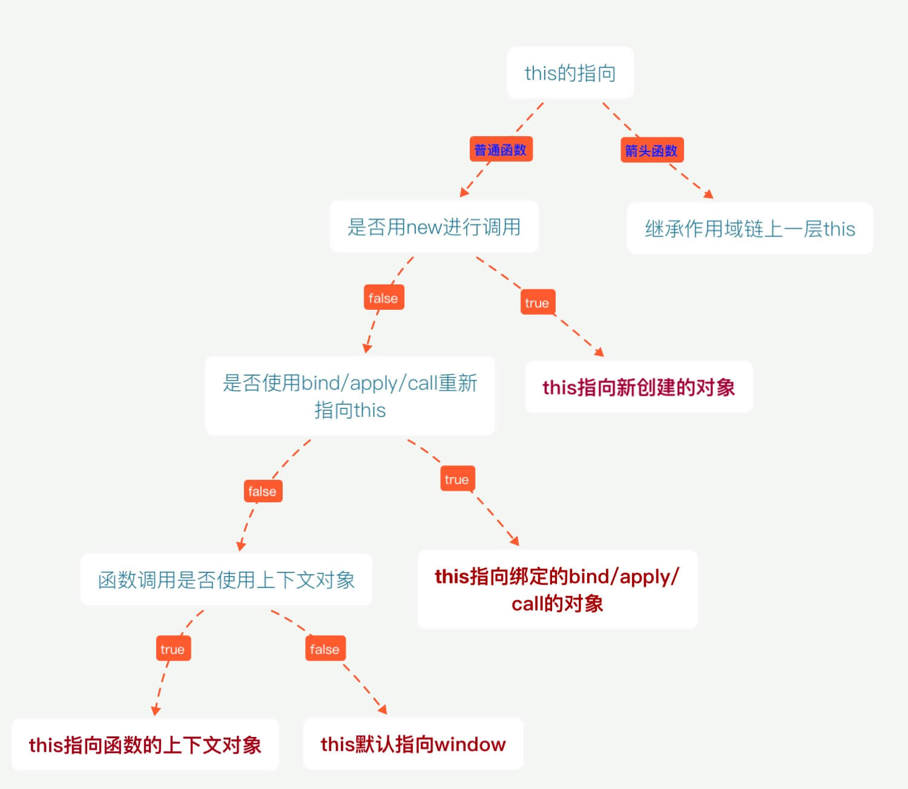

> JavaScript 被认为是世界上最受误解的编程语言，因为它身披 c 语言家族的外衣，表现的却是 LISP 风格的函数式语言特性；没有类，却实也彻底实现了面向对象。要对这门语言有透彻的理解，就必须扒开其 c 语言的外衣，从新回到函数式编程的角度，同时摒弃原有类的面向对象概念去学习领悟它

## 语言简介

JavaScript（简称“JS”） 是一种具有函数优先的轻量级，解释型或即时编译型的高级编程语言。虽然它是作为开发 Web 页面的脚本语言而出名的，但是它也被用到了很多非浏览器环境中，JavaScript 基于原型编程、多范式的动态脚本语言，并且支持面向对象、命令式和声明式（如函数式编程）风格。

JavaScript 在 1995 年由 Netscape 公司的 Brendan Eich，在网景导航者浏览器上首次设计实现而成。因为 Netscape 与 Sun 合作，Netscape 管理层希望它外观看起来像 Java，因此取名为 JavaScript。但实际上它的语法风格与 Self 及 Scheme 较为接近。

JavaScript 的标准是 ECMAScript 。截至 2012 年，所有浏览器都完整的支持 ECMAScript 5.1，旧版本的浏览器至少支持 ECMAScript 3 标准。2015 年 6 月 17 日，ECMA 国际组织发布了 ECMAScript 的第六版，该版本正式名称为 ECMAScript 2015，但通常被称为 ECMAScript 6 或者 ES6。

Javascript 是一种基于对象（object-based）的语言。但是，它又不是一种真正的面向对象编程（OOP）语言，因为它的语法中没有 class（类）—–es6 以前是这样的。所以 es5 只有使用函数模拟的面向对象。

### 组成部分

- ECMAScript，描述了该语言的语法和基本对象。
- 文档对象模型（DOM），描述处理网页内容的方法和接口。
- 浏览器对象模型（BOM），描述与浏览器进行交互的方法和接口。

### 特性

JavaScript 脚本语言具有以下特点:

1. 脚本语言。JavaScript 是一种解释型的脚本语言,C、C++等语言先编译后执行,而 JavaScript 是在程序的运行过程中逐行进行解释。
2. 基于对象。JavaScript 是一种基于对象的脚本语言,它不仅可以创建对象,也能使用现有的对象。
3. 简单。JavaScript 语言中采用的是弱类型的变量类型,对使用的数据类型未做出严格的要求,是基于 Java 基本语句和控制的脚本语言,其设计简单紧凑。
4. 动态性。JavaScript 是一种采用事件驱动的脚本语言,它不需要经过 Web 服务器就可以对用户的输入做出响应。在访问一个网页时,鼠标在网页中进行鼠标点击或上下移、窗口移动等操作 JavaScript 都可直接对这些事件给出相应的响应。
5. 跨平台性。JavaScript 脚本语言不依赖于操作系统,仅需要浏览器的支持。因此一个 JavaScript 脚本在编写后可以带到任意机器上使用,前提上机器上的浏览器支 持 JavaScript 脚本语言,JavaScript 已被大多数的浏览器所支持。

不同于服务器端脚本语言，例如 PHP 与 ASP，JavaScript 主要被作为客户端脚本语言在用户的浏览器上运行，不需要服务器的支持。所以在早期程序员比较青睐于 JavaScript 以减少对服务器的负担，而与此同时也带来另一个问题：安全性。

而随着服务器的强壮，虽然程序员更喜欢运行于服务端的脚本以保证安全，但 JavaScript 仍然以其跨平台、容易上手等优势大行其道。同时，有些特殊功能（如 AJAX）必须依赖 Javascript 在客户端进行支持。

## 2 原型 / 构造函数 / 实例 / 原型链

- 原型`(prototype)`: 一个简单的对象，用于实现对象的 **属性继承**。可以简单的理解成对象的爹。在 Firefox 和 Chrome 中，每个`JavaScript`对象中都包含一个`__proto__` (非标准)的属性指向它爹(该对象的原型)，可`obj.__proto__`进行访问。

- 构造函数: 可以通过`new`来 **新建一个对象** 的函数。

- 实例: 通过构造函数和`new`创建出来的对象，便是实例。 **实例通过`__proto__`指向原型，通过`constructor`指向构造函数**。

说了一大堆，大家可能有点懵逼，这里来举个栗子，以`Object`为例，我们常用的`Object`便是一个构造函数，因此我们可以通过它构建实例。

```js
// 实例
const instance = new Object();
```

则此时， **实例为`instance`**, **构造函数为`Object`**，我们知道，构造函数拥有一个`prototype`的属性指向原型，因此原型为:

```js
// 原型
const prototype = Object.prototype;
```

这里我们可以来看出三者的关系:

```js
// 实例.__proto__ === 原型
// 原型.constructor === 构造函数
// 构造函数.prototype === 原型
// 实例.constructor === 构造函数
function Person() {}
// 虽然写在注释里，但是你要注意：
// prototype是函数才会有的属性
Person.prototype.name = "Drex";
var person1 = new Person();
var person2 = new Person();
console.log(person1.__proto__ === Person.prototype); // true
console.log(Person === Person.prototype.constructor); // true
// 顺便学习一个ES5的方法,可以获得对象的原型
console.log(Object.getPrototypeOf(person1) === Person.prototype); // true
console.log(person1.name); // Drex
person1.name = "Daisy";
console.log(person1.name); // Daisy

delete person1.name;
console.log(person1.name); // Drex
console.log(Object.getPrototypeOf(person1));
// Object.prototype的原型为null
console.log(Object);
console.log(Object.prototype.__proto__ === null); // true
```


- 原型链：

  - **原型链是由原型对象组成**，每个对象都有 `__proto__` 属性，指向了创建该对象的构造函数的原型，`__proto__` 将对象连接起来组成了原型链。是一个用来**实现继承和共享属性**的有限的对象链。

  - **属性查找机制**: 当查找对象的属性时，如果实例对象自身不存在该属性，则沿着原型链往上一级查找，找到时则输出，不存在时，则继续沿着原型链往上一级查找，直至最顶级的原型对象`Object.prototype`，如还是没找到，则输出`undefined`；

  - **属性修改机制**: 只会修改实例对象本身的属性，如果不存在，则进行添加该属性，如果需要修改原型的属性时，则可以用: `b.prototype.x = 2`；但是这样会造成所有继承于该对象的实例的属性发生改变。

## 3 执行上下文(EC) / 执行模型

执行上下文(Execution Context)可以简单理解为一个对象:

- 它包含三个部分:
  - 变量对象(VO)
  - 作用域链(词法作用域)
  - `this`指向
- 它的类型:
  - 全局执行上下文
  - 函数执行上下文
  - `eval`执行上下文
- 代码执行过程:
  - 创建 **全局上下文** (global EC)
  - 全局执行上下文 (caller) 逐行 **自上而下** 执行。遇到函数时，**函数执行上下文** (callee) 被`push`到执行栈顶层
  - 函数执行上下文被激活，成为 active EC, 开始执行函数中的代码，caller 被挂起
  - 函数执行完后，callee 被`pop`移除出执行栈，控制权交还全局上下文 (caller)，继续执行

### 3.1 变量对象

变量对象，是执行上下文中的一部分，可以抽象为一种 **数据作用域**，其实也可以理解为就是一个简单的对象，它存储着该执行上下文中的所有 **变量和函数声明(不包含函数表达式)**。

> 活动对象 (AO): 当变量对象所处的上下文为 active EC 时，称为活动对象。

### 3.2 作用域

执行上下文中还包含作用域链。理解作用域之前，先介绍下作用域。作用域其实可理解为该上下文中声明的 **变量和声明的作用范围**。可分为 **块级作用域** 和 **函数作用域**

特性:

- **声明提前**: 一个声明在函数体内都是可见的, 函数优先于变量
- 非匿名自执行函数，函数变量为 **只读** 状态，无法修改

```js
let foo = (function() {
  console.log(1);
})(
  (function foo() {
    foo = 10; // 由于foo在函数中只为可读，因此赋值无效
    console.log(foo);
  })()
);

// 结果打印：  ƒ foo() { foo = 10 ; console.log(foo) }
```

### 3.3 this 指向

由于 JS 的设计原理: 在函数中，可以引用运行环境中的变量。因此就需要一个机制来让我们可以在函数体内部获取当前的运行环境，这便是`this`。

因此要明白 `this` 指向，其实就是要搞清楚 函数的运行环境，说人话就是，谁调用了函数。例如:

- `obj.fn()`，便是 `obj` 调用了函数，既函数中的 `this === obj`
- `fn()`，这里可以看成 `window.fn()`，因此 `this === window`

但这种机制并不完全能满足我们的业务需求，因此提供了三种方式可以手动修改 `this` 的指向:

- `call: fn.call(target, 1, 2)`
- `apply: fn.apply(target, [1, 2])`
- `bind: fn.bind(target)(1,2)`



[参考](https://didiheng.com/front/2019-09-12.html)

### 3.4 作用域链

我们知道，我们可以在执行上下文中访问到父级甚至全局的变量，这便是作用域链的功劳。作用域链可以理解为一组对象列表，包含 **父级和自身的变量对象**，因此我们便能通过作用域链访问到父级里声明的变量或者函数。

由两部分组成:

- `[[scope]]`属性: 指向父级变量对象和作用域链，也就是包含了父级的`[[scope]]`和`AO`
- AO: 自身活动对象

### 3.5 闭包

闭包属于一种特殊的作用域，称为 **静态作用域**。它的定义可以理解为: **父函数被销毁** 的情况下，返回出的子函数的`[[scope]]`中仍然保留着父级的单变量对象和作用域链，因此可以继续访问到父级的变量对象，这样的函数称为闭包。

- 闭包会产生一个很经典的问题:

  - 多个子函数的`[[scope]]`都是同时指向父级，是完全共享的。因此当父级的变量对象被修改时，所有子函数都受到影响。

- 解决:
  - 变量可以通过 **函数参数的形式** 传入，避免使用默认的`[[scope]]`向上查找
  - 使用`setTimeout`包裹，通过第三个参数传入
  - 使用 **块级作用域**，让变量成为自己上下文的属性，避免共享

如此 `[[scopr]]`包含`[[scope]]`，便自上而下形成一条 **链式作用域**。

## 4 script 引入方式：

- html 静态`<script>`引入
- js 动态插入`<script>`
- `<script defer>`: 异步加载，元素解析完成后执行
- `<script async>`: 异步加载，但执行时会阻塞元素渲染

## 5 对象的拷贝

- 浅拷贝: 以赋值的形式拷贝引用对象，仍指向同一个地址，**修改时原对象也会受到影响**

  - `Object.assign`
  - 展开运算符(...)

- 深拷贝: 完全拷贝一个新对象，**修改时原对象不再受到任何影响**
  - `JSON.parse(JSON.stringify(obj))`: 性能最快
    - 具有循环引用的对象时，报错
    - 当值为函数、`undefined`、或`symbol`时，无法拷贝
  - 递归进行逐一赋值

## 6 new 运算符的执行过程

- 新生成一个对象
- 链接到原型: `obj.__proto__ = Con.prototype`
- 绑定 this: `apply`
- 返回新对象(如果构造函数有自己 retrun 时，则返回该值)

```js
const Person = {};
function Father() {
  console.log(123);
}
const p = new Person();
const f = new Father();
console.log(p, f);
function create() {
  // 创建一个对象
  let obj = {};
  // 取出构建函数及参数，shift能改变原数组，返回第一个值
  Constructor = [].shift.call(arguments);
  // 将对象的原始指向构建函数的原型
  obj.__proto__ = Constructor.prototype;
  // 改变原型指向（obj 就可以访问到构造函数中的属性）及赋值参数
  const ret = Constructor.apply(obj, arguments);
  // 返回对象
  return typeof ret === "object" ? ret : obj;
}
const pc = create(Person);
const fc = create(Father);
console.log(pc, fc);
```

## 7 instanceof 原理

能在实例的 **原型对象链** 中找到该构造函数的`prototype`属性所指向的 **原型对象**，就返回`true`。即:

```js
// __proto__: 代表原型对象链
instance.[__proto__...] === instance.constructor.prototype

// return true
```

## 8 代码的复用

当你发现任何代码开始写第二遍时，就要开始考虑如何复用。一般有以下的方式:

- 函数封装
- 继承
- 复制`extend`
- 混入`mixin`
- 借用`apply/call`

## 9 继承

面向对象编程很重要的一个方面，就是对象的继承。A 对象通过继承 B 对象，就能直接拥有 B 对象的所有属性和方法。这对于代码的复用是非常有用的。
大部分面向对象的编程语言，都是通过“类”（class）实现对象的继承。传统上，JavaScript 语言的继承不通过 class(ES6 引入了 class 语法)，而是通过“原型对象”（prototype）实现。那么在 JS 中常见的继承方式有几种呢？

### 原型链继承

在 JS 中，继承通常指的便是 **原型链继承**，也就是通过指定原型，并可以通过原型链继承原型上的属性或者方法。

1. 引用类型的属性被所有实例共享
2. 在创建 Child 的实例时，不能向Parent传参

```js
function Parent() {
  this.names = ["kevin", "daisy"];
}

function Child() {}

Child.prototype = new Parent();

var child1 = new Child();

child1.names.push("yayu");

console.log(child1.names); // ["kevin", "daisy", "yayu"]

var child2 = new Child();

console.log(child2.names); // ["kevin", "daisy", "yayu"]
```

### 借用构造函数(经典继承)

优点：

1. 避免了引用类型的属性被所有实例共享
2. 可以在 Child 中向 Parent 传参

缺点：

方法都在构造函数中定义，每次创建实例都会创建一遍方法。

```js
function Parent(name) {
  this.name = name;
}

function Child(name) {
  Parent.call(this, name);
}

var child1 = new Child("kevin");

console.log(child1.name); // kevin

var child2 = new Child("daisy");

console.log(child2.name); // daisy
```

### 组合继承

原型链继承和经典继承双剑合璧。融合原型链继承和构造函数的优点，是 JavaScript 中最常用的继承模式。

```js
function Parent(name) {
  this.name = name;
  this.colors = ["red", "blue", "green"];
}

Parent.prototype.getName = function() {
  console.log(this.name);
};

function Child(name, age) {
  Parent.call(this, name);

  this.age = age;
}

Child.prototype = new Parent();
Child.prototype.constructor = Child;

var child1 = new Child("kevin", "18");

child1.colors.push("black");

console.log(child1.name); // kevin
console.log(child1.age); // 18
console.log(child1.colors); // ["red", "blue", "green", "black"]

var child2 = new Child("daisy", "20");

console.log(child2.name); // daisy
console.log(child2.age); // 20
console.log(child2.colors); // ["red", "blue", "green"]
```

### 原型式继承

就是 ES5 Object.create 的模拟实现，将传入的对象作为创建的对象的原型。包含引用类型的属性值始终都会共享相应的值，这点跟原型链继承一样。

```js
var person = {
    name: 'kevin',
    friends: ['daisy', 'kelly']
}

var person1 = createObj(person);
var person2 = createObj(person);

person1.name = 'person1'; // 给person1添加了 name 值，并非修改了原型上的 name 值
console.log(person2.name); // kevin 

person1.firends.push('taylor');
console.log(person2.friends); // ["daisy", "kelly", "taylor"]
```

### 寄生式继承

创建一个仅用于封装继承过程的函数，该函数在内部以某种形式来做增强对象，最后返回对象。
缺点：跟借用构造函数模式一样，每次创建对象都会创建一遍方法。

```js
function createObj (o) {
    var clone = Object.create(o);
    clone.sayName = function () {
        console.log('hi');
    }
    return clone;
}
```

### 寄生组合式继承

这种方式的高效率体现它只调用了一次 `Parent` 构造函数，并且因此避免了在 `Parent.prototype` 上面创建不必要的、多余的属性。与此同时，原型链还能保持不变；因此，还能够正常使用 `instanceof` 和 `isPrototypeOf`。开发人员普遍认为寄生组合式继承是引用类型最理想的继承范式。

```js
function Parent (name) {
    this.name = name;
    this.colors = ['red', 'blue', 'green'];
}

Parent.prototype.getName = function () {
    console.log(this.name)
}

function Child (name, age) {
    Parent.call(this, name);
    this.age = age;
}
function object(o) {
    function F() {}
    F.prototype = o;
    return new F();
}

function prototype(child, parent) {
    var prototype = object(parent.prototype);
    prototype.constructor = child;
    child.prototype = prototype;
}

// 当我们使用的时候：
prototype(Child, Parent);
```

## 10 类型转换

大家都知道 JS 中在使用运算符号或者对比符时，会自带隐式转换，规则如下:

- -、\*、/、% ：一律转换成数值后计算
- +： - 数字 + 字符串 = 字符串， 运算顺序是从左到右 - 数字 + 对象， 优先调用对象的`valueOf` -> `toString` - 数字 + `boolean/null` -> 数字 - 数字 + `undefined` -> `NaN`
- `[1].toString() === '1'`
- `{}.toString() === '[object object]'`
- `NaN` !== `NaN` 、`+undefined 为 NaN`

## 11 类型判断

判断 Target 的类型，单单用 typeof 并无法完全满足，这其实并不是 bug，本质原因是 JS 的万物皆对象的理论。因此要真正完美判断时，我们需要区分对待:

- 基本类型(`null`): 使用 `String(null)`
- 基本类型(`string / number / boolean / undefined`) + `function`: 直接使用 `typeof`即可
- 其余引用类型(`Array / Date / RegExp Error`): 调用`toString`后根据`[object XXX]`进行判断

很稳的判断封装:

```js
let class2type = {};
"Array Date RegExp Object Error"
  .split(" ")
  .forEach((e) => (class2type["[object " + e + "]"] = e.toLowerCase()));

function type(obj) {
  if (obj == null) return String(obj);
  return typeof obj === "object"
    ? class2type[Object.prototype.toString.call(obj)] || "object"
    : typeof obj;
}
```

## 12 模块化

模块化开发在现代开发中已是必不可少的一部分，它大大提高了项目的可维护、可拓展和可协作性。通常，我们 **在浏览器中使用 ES6 的模块化支持，在 Node 中使用 commonjs 的模块化支持。**

- 分类: - es6: `import / export` - commonjs: `require / module.exports / exports` - amd: `require / defined`

- `require`与`import`的区别 - `require`支持 **动态导入**，`import`不支持，正在提案 (babel 下可支持) - `require`是 **同步** 导入，`import`属于 **异步** 导入 - `require`是 **值拷贝**，导出值变化不会影响导入值；`import`指向 **内存地址**，导入值会随导出值而变化

## 13 防抖与节流

防抖与节流函数是一种最常用的 **高频触发优化方式**，能对性能有较大的帮助。

- **防抖 (debounce)**: 将多次高频操作优化为只在最后一次执行，通常使用的场景是：用户输入，只需再输入完成后做一次输入校验即可。

```js
function debounce(fn, wait, immediate) {
  let timer = null;

  return function() {
    let args = arguments;
    let context = this;

    if (immediate && !timer) {
      fn.apply(context, args);
    }

    if (timer) clearTimeout(timer);
    timer = setTimeout(() => {
      fn.apply(context, args);
    }, wait);
  };
}
```

- **节流(throttle)**: 每隔一段时间后执行一次，也就是降低频率，将高频操作优化成低频操作，通常使用场景: 滚动条事件 或者 resize 事件，通常每隔 100~500 ms 执行一次即可。

```js
function throttle(fn, wait, immediate) {
  let timer = null;
  let callNow = immediate;

  return function() {
    let context = this,
      args = arguments;

    if (callNow) {
      fn.apply(context, args);
      callNow = false;
    }

    if (!timer) {
      timer = setTimeout(() => {
        fn.apply(context, args);
        timer = null;
      }, wait);
    }
  };
}
```

区别： 不管事件触发有多频繁，节流都会保证在规定时间内一定会执行一次真正的事件处理函数，而防抖只是在最后一次事件触发后才执行一次函数。

场景：

- 防抖：比如监听页面滚动，滚动结束并且到达一定距离时显示返回顶部按钮，适合使用防抖。
- 节流：比如在页面的无限加载场景下，需要用户在滚动页面时过程中，每隔一段时间发一次 Ajax 请求，而不是在用户停下滚动页面操作时才去请求数据。此场景适合用节流来实现。

## 14 函数柯里化

在一个函数中，首先填充几个参数，然后再返回一个新的函数的技术，称为函数的柯里化。通常可用于在不侵入函数的前提下，为函数 **预置通用参数**，供多次重复调用。

```js
const add = function add(x) {
  return function(y) {
    return x + y;
  };
};

const add1 = add(1);

add1(2) === 3;
add1(20) === 21;
```

## 15 AST 抽象语法树

**抽象语法树 (Abstract Syntax Tree)**，是将代码逐字母解析成 **树状对象** 的形式。这是语言之间的转换、代码语法检查，代码风格检查，代码格式化，代码高亮，代码错误提示，代码自动补全等等的基础。例如:

```js
function square(n) {
  return n * n;
}
```

体验地址：[AST Explorer](https://astexplorer.net/)

## 16 babel 编译原理

- babylon 将 ES6/ES7 代码解析成 AST
- babel-traverse 对 AST 进行遍历转译，得到新的 AST
- 新 AST 通过 babel-generator 转换成 ES5

体验地址：[Babel](https://babeljs.io/)

参考
[网道 JavaScript 教程](https://wangdoc.com/javascript/)
