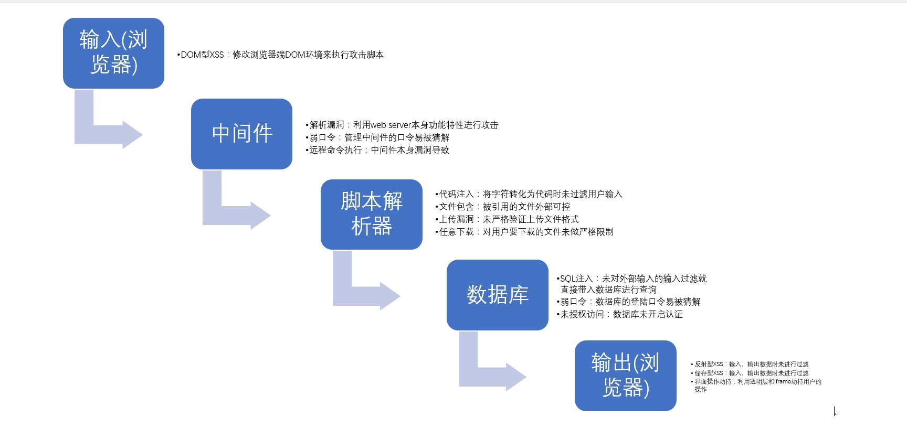

# Web 安全

安全的本质其实是数据流，搞懂《HTTP权威指南》720页，你就会明白安全术语的“输入输出”。
黑客通过输入提交“特殊数据”，特殊数据在数据流的每个层处理，如果某个层没处理好，在输出的时候，就会出现相应层的安全问题。

## Web攻击

### CSRF
跨站请求伪造，可以理解为攻击者盗用了用户的身份，以用户的名义发送了恶意请求，比如用户登录了一个网站后，立刻在另一个ｔａｂ页面访问量攻击者用来制造攻击的网站，这个网站要求访问刚刚登陆的网站，并发送了一个恶意请求，这时候CSRF就产生了，比如这个制造攻击的网站使用一张图片，但是这种图片的链接却是可以修改数据库的，这时候攻击者就可以以用户的名义操作这个数据库，防御方式的话：使用验证码，检查https头部的refer，使用token

XSS防御的总体思路是：对输入(和URL参数)进行过滤，对输出进行编码。也就是对提交的所有内容进行过滤，对url中的参数进行过滤，过滤掉会导致脚本执行的相关内容；然后对动态输出到页面的内容进行html编码，使脚本无法在浏览器中执行。虽然对输入过滤可以被绕过，但是也还是会拦截很大一部分的XSS攻击。

### XSS
跨站脚本攻击，是说攻击者通过注入恶意的脚本，在用户浏览网页的时候进行攻击，比如获取cookie，或者其他用户身份信息，可以分为存储型和反射型，存储型是攻击者输入一些数据并且存储到了数据库中，其他浏览者看到的时候进行攻击，反射型的话不存储在数据库中，往往表现为将攻击代码放在url地址的请求参数中，防御的话为cookie设置httpOnly属性，对用户的输入进行检查，进行特殊字符过滤

防御CSRF 攻击主要有三种策略：验证 HTTP Referer 字段；在请求地址中添加 token 并验证；在 HTTP 头中自定义属性并验证。

### SQL注入

[零基础如何学习 Web 安全？](https://www.zhihu.com/question/21606800)