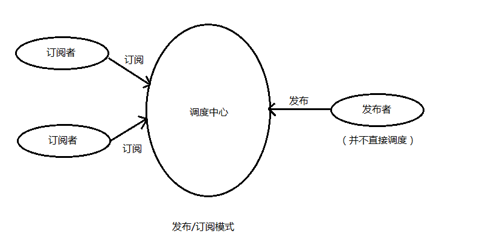

## GoF 的 23 种设计模式的功能介绍

### 创建型设计模式

1. 单例（Singleton）模式：某个类只能生成一个实例，该类提供了一个全局访问点供外部获取该实例，其拓展是有限多例模式。
2. 原型（Prototype）模式：将一个对象作为原型，通过对其进行复制而克隆出多个和原型类似的新实例。
3. 工厂方法（Factory Method）模式：定义一个用于创建产品的接口，由子类决定生产什么产品。
4. 抽象工厂（AbstractFactory）模式：提供一个创建产品族的接口，其每个子类可以生产一系列相关的产品。
5. 建造者（Builder）模式：将一个复杂对象分解成多个相对简单的部分，然后根据不同需要分别创建它们，最后构建成该复杂对象。

### 结构设计模式

6. 代理（Proxy）模式：为某对象提供一种代理以控制对该对象的访问。即客户端通过代理间接地访问该对象，从而限制、增强或修改该对象的一些特性。
7. 适配器（Adapter）模式：将一个类的接口转换成客户希望的另外一个接口，使得原本由于接口不兼容而不能一起工作的那些类能一起工作。
8. 桥接（Bridge）模式：将抽象与实现分离，使它们可以独立变化。它是用组合关系代替继承关系来实现，从而降低了抽象和实现这两个可变维度的耦合度。
9. 装饰（Decorator）模式：动态的给对象增加一些职责，即增加其额外的功能。
10. 外观（Facade）模式：为多个复杂的子系统提供一个一致的接口，使这些子系统更加容易被访问。
11. 享元（Flyweight）模式：运用共享技术来有效地支持大量细粒度对象的复用。
12. 组合（Composite）模式：将对象组合成树状层次结构，使用户对单个对象和组合对象具有一致的访问性。

### 行为设计模式

13. 模板方法（TemplateMethod）模式：定义一个操作中的算法骨架，而将算法的一些步骤延迟到子类中，使得子类可以不改变该算法结构的情况下重定义该算法的某些特定步骤。
14. 策略（Strategy）模式：定义了一系列算法，并将每个算法封装起来，使它们可以相互替换，且算法的改变不会影响使用算法的客户。
15. 命令（Command）模式：将一个请求封装为一个对象，使发出请求的责任和执行请求的责任分割开。
16. 职责链（Chain of Responsibility）模式：把请求从链中的一个对象传到下一个对象，直到请求被响应为止。通过这种方式去除对象之间的耦合。
17. 状态（State）模式：允许一个对象在其内部状态发生改变时改变其行为能力。
18. 观察者（Observer）模式：多个对象间存在一对多关系，当一个对象发生改变时，把这种改变通知给其他多个对象，从而影响其他对象的行为。
19. 中介者（Mediator）模式：定义一个中介对象来简化原有对象之间的交互关系，降低系统中对象间的耦合度，使原有对象之间不必相互了解。
20. 迭代器（Iterator）模式：提供一种方法来顺序访问聚合对象中的一系列数据，而不暴露聚合对象的内部表示。
21. 访问者（Visitor）模式：在不改变集合元素的前提下，为一个集合中的每个元素提供多种访问方式，即每个元素有多个访问者对象访问。
22. 备忘录（Memento）模式：在不破坏封装性的前提下，获取并保存一个对象的内部状态，以便以后恢复它。
23. 解释器（Interpreter）模式：提供如何定义语言的文法，以及对语言句子的解释方法，即解释器。


## 单例模式

- 保证一个类仅有一个实例，并提供一个全局访问它的访问点
- 惰性单例模式是在需要的时候再初始化

### 实现

```js
class Sington {
  constructor(key, value) {
    this.key = key;
    this.value = value;
  }
  static getInstance(key, value) {
    if (!this.instance) {
      this.instance = new Sington(key, value);
    }
    return this.instance;
  }
}
const a1 = Sington.getInstance("Drex", "Wang1");
const a2 = Sington.getInstance("Drex", "Wang2");
const a3 = Sington.getInstance("Drex", "Wang3");
console.log(a1 === a2);
console.log(a1 === a3);
```

### 应用

- 模态框弹窗的时候，不希望有两个弹窗

## 工厂模式

工厂模式是另外一种关注对象创建概念的创建模式。它的领域中同其它模式的不同之处在于它并没有明确要求我们使用一个构造器。取而代之，一个工厂能提供一个创建对象的公共接口，我们可以在其中指定我们希望被创建的工厂对象的类型。

### 实现

简单工厂模式

```js
class User {
  constructor(arg) {
    this.name = arg.name;
    this.menu = arg.menu;
  }
  static getInstance(role) {
    switch (role) {
      case "Administrator":
        return new User({
          name: "超级管理员",
          menu: ["首页", "商品管理", "资讯管理", "系统管理"],
        });
        break;
      case "Admin":
        return new User({
          name: "管理员",
          menu: ["首页", "商品管理", "资讯管理"],
        });
        break;
      case "User":
        return new User({ name: "用户", menu: ["首页", "商品管理"] });
        break;
      default:
        throw new Error("参数错误：可选Administrator，Admin，User");
    }
  }
}
const administrator = User.getInstance("Administrator");
const admin = User.getInstance("Admin");
const user = User.getInstance("user");
```

工厂方法模式

```js
class User {
  constructor(name = "", menu = []) {
    if (new.target === User) {
      throw new Error("抽象类不能实例化!");
    }
    this.name = name;
    this.menu = menu;
  }
}

class UserFactory extends User {
  constructor(name, menu) {
    super(name, menu);
  }
  create(role) {
    switch (role) {
      case "administrator":
        return new UserFactory("超级管理员", [
          "首页",
          "通讯录",
          "发现页",
          "应用数据",
          "权限管理",
        ]);
        break;
      case "admin":
        return new UserFactory("普通用户", ["首页", "通讯录", "发现页"]);
        break;
      case "user":
        return new UserFactory("普通用户", ["首页", "通讯录", "发现页"]);
        break;
      default:
        throw new Error("参数错误, 可选参数:administrator、admin、user");
    }
  }
}

let userFactory = new UserFactory();
let administrator = userFactory.create("administrator");
let admin = userFactory.create("admin");
let user = userFactory.create("user");
```

抽象工厂模式

```js
class User {
  constructor(type) {
    if (new.target === User) {
      throw new Error("抽象类不能实例化!");
    }
    this.type = type;
  }
}

class UserOfWechat extends User {
  constructor(name) {
    super("wechat");
    this.name = name;
    this.viewPage = ["首页", "通讯录", "发现页"];
  }
}

class UserOfQq extends User {
  constructor(name) {
    super("qq");
    this.name = name;
    this.viewPage = ["首页", "通讯录", "发现页"];
  }
}

class UserOfWeibo extends User {
  constructor(name) {
    super("weibo");
    this.name = name;
    this.viewPage = ["首页", "通讯录", "发现页"];
  }
}

function getAbstractUserFactory(type) {
  switch (type) {
    case "wechat":
      return UserOfWechat;
      break;
    case "qq":
      return UserOfQq;
      break;
    case "weibo":
      return UserOfWeibo;
      break;
    default:
      throw new Error("参数错误, 可选参数:administrator、admin、user");
  }
}

let WechatUserClass = getAbstractUserFactory("wechat");
let QqUserClass = getAbstractUserFactory("qq");
let WeiboUserClass = getAbstractUserFactory("weibo");

let wechatUser = new WechatUserClass("微信小李");
let qqUser = new QqUserClass("QQ小李");
let weiboUser = new WeiboUserClass("微博小李");
```

### 应用

- 对象或者组件设置涉及到高程度级别的复杂度时:权限路由
- 需要根据我们所在的环境方便的生成不同对象的实体时。
- 许多共享同一个属性的许多小型对象或组件上工作时。
- 带有其它仅仅需要满足一种 API 约定(又名鸭式类型)的对象的组合对象工作时.这对于解耦来说是有用的。

## 建造者模式

建造者模式的特点是分步构建一个复杂的对象，可以用不同组合或顺序建造出不同意义的对象，通常使用者并不需要知道建造的细节，通常使用链式调用来进行建造过程，最后调用 build 方法来生成最终对象。

同样作为创建型的设计模式，需要注意和工厂模式的区别，工厂虽然也是创建对象，但怎样创建无所谓，工厂模式关注的是创建的结果；而建造者模式不仅得到了结果，同时也参与了创建的具体过程，适合用来创建一个复杂的复合对象。

### 实现

```js
class baseBuilder {
  // 创建
  init() {
    Object.keys(this).forEach((key) => {
      // 方法名
      const funName = `with${key.substring(0, 1).toUpperCase()}${key.substring(
        1
      )}`;
      this[funName] = (val) => {
        this[key] = val;
        return this;
      };
    });
  }
  // 构建
  build() {
    // 计算属性key
    const keys = Object.keys(this).filter(
      (key) => typeof this[key] !== "function"
    );
    // 返回属性值
    return keys.reduce((prev, next) => ({ ...prev, [next]: this[next] }), {});
  }
}
class carBuilder extends baseBuilder {
  constructor() {
    super();
    this.name = "";
    this.brand = "";
    this.model = "";
    this.year = "";
    super.init();
  }
}
class userBuilder extends baseBuilder {
  constructor() {
    super();
    this.name = "";
    this.sex = "";
    this.age = "";
    super.init();
  }
}

const car = new carBuilder()
  .withName("大奔")
  .withBrand("奔驰")
  .withModel("E300")
  .withYear("2020")
  .build();
const people = new userBuilder()
  .withName("Drex")
  .withSex("男")
  .withAge("30")
  .build();
```

### 应用

- 只适合创建极为复杂的对象

## 代理模式

### 缓存代理

缓存代理可以将一些开销很大的方法的运算结果进行缓存，再次调用该函数时，若参数一致，则可以直接返回缓存中的结果，而不用再重新进行运算。

```js
// 缓存的斐波那契数列
const getFib = (number) => {
  if (number <= 2) {
    return 1;
  } else {
    return getFib(number - 1) + getFib(number - 2);
  }
};
const getCacheProxy = (fn, cache = new Map()) => {
  return new Proxy(fn, {
    apply(target, context, args) {
      const argsString = args.join(" ");
      if (cache.has(argsString)) {
        // 如果有缓存,直接返回缓存数据
        console.log(`输出${args}的缓存结果: ${cache.get(argsString)}`);

        return cache.get(argsString);
      }
      const result = fn(...args);
      cache.set(argsString, result);

      return result;
    },
  });
};
const getFibProxy = getCacheProxy(getFib);
getFibProxy(40); // 102334155
getFibProxy(40); // 输出40的缓存结果: 102334155
```

### 保护代理

```js
// 表单验证
const userForm = {
  account: "",
  password: "",
};

// 验证方法
const validators = {
  account(value) {
    // account 只允许为中文
    const re = /^[\u4e00-\u9fa5]+$/;
    return {
      valid: re.test(value),
      error: '"account" is only allowed to be Chinese',
    };
  },
  password(value) {
    // password 的长度应该大于6个字符
    return {
      valid: value.length >= 6,
      error: '"password "should more than 6 character',
    };
  },
};
// 表单验证器
const getValidateProxy = (target, validators) =>
  new Proxy(target, {
    _validators: validators,
    set(target, props, value) {
      if (value === "") {
        console.error(`"${props}" is not allowed to be empty`);
        return (target[props] = false);
      }
      // 执行判断条件
      const validResult = this._validators[props](value);
      if (validResult.valid) {
        return Reflect.set(target, props, value);
      } else {
        console.error(`${validResult.error}`);
        return (target[props] = false);
      }
    },
  });
const userFormProxy = getValidateProxy(userForm, validators);
userFormProxy.account = "123"; // "account" is only allowed to be Chinese
userFormProxy.password = "he"; // "password "should more than 6 character
```

### 虚拟代理

```js
// 函数防抖，频繁操作中不处理，直到操作完成之后（再过 delay 的时间）才一次性处理
function debounce(fn, delay) {
  delay = delay || 200;

  let timer = null;

  return function() {
    let arg = arguments;

    // 每次操作时，清除上次的定时器
    clearTimeout(timer);
    timer = null;

    // 定义新的定时器，一段时间后进行操作
    timer = setTimeout(function() {
      fn.apply(this, arg);
    }, delay);
  };
}

let count = 0;

// 主体
function scrollHandle(e) {
  console.log(e.type, ++count); // scroll
}

// 代理
const proxyScrollHandle = debounce(scrollHandle, 500);

window.onscroll = proxyScrollHandle;
```

### 应用

- 缓存代理用于异步请求数据
- 保护代理用于权限访问
- 虚拟代理实现图片预加载
- 虚拟代理合并http请求

## 适配器模式

### 实现

调用不能平台的接口，做规范统一返回

```js
function apiAdapter(data) {
  if (data.source) {
    return {
      data: data.source,
      code: data.status === 'ok' ? 0 : 1
    }
  }
  return data
}
const api1 = {
  data: {},
  code: 0
}
const api2 = {
  source: {},
  status: 'ok'
}
```

### 应用

- 库的适配
- 参数适配
- 数据适配

## 装饰器模式

### 实现
```js
// 类装饰器
@testable
class MyTestableClass {
  @log
  add(a, b) {
    return a + b;
  }
}

function testable(target) {
  target.isTestable = true;
}
function log(target, name, descriptor) {
  var oldValue = descriptor.value;

  descriptor.value = function() {
    console.log(`Calling ${name} with`, arguments);
    return oldValue.apply(this, arguments);
  };

  return descriptor;
}

MyTestableClass.isTestable
new MyTestableClass().add()
```

### 应用

- `@deprecate` 实现警告提示
- `@log` 打印日志装饰器
- `@fetchInfo` 上报信息装饰器

## 享元模式

## 组合模式

## 模版方法模式

## 策略模式

## 命令模式

## 职责链模式

## 状态模式

## 观察者模式

定义了对象间一种一对多的依赖关系，当目标对象 Subject 的状态发生改变时，所有依赖它的对象 Observer 都会得到通知。

### 实现

```js
class Subject {
  constructor() {
    this.observers = [];
  }
  add(observer) {
    this.observers.push(observer);
  }
  remove(observer) {
    let idx = this.observers.findIndex((item) => item === observer);
    idx > -1 && this.observers.splice(idx, 1);
  }
  notify() {
    for (let o of this.observers) {
      o.update();
    }
  }
}
class Observer {
  constructor(name) {
    this.name = name;
  }
  update() {
    console.log(`目标者通知我更新了，我是：${this.name}`);
  }
}
// 实例化目标者
let subject = new Subject();

// 实例化两个观察者
let obs1 = new Observer("Drex");
let obs2 = new Observer("Wang");

// 向目标者添加观察者
subject.add(obs1);
subject.add(obs2);

subject.notify();
```

### 优缺点

- 目标者与观察者，功能耦合度降低，专注自身功能逻辑；
- 观察者被动接收更新，时间上解耦，实时接收目标者更新状态。

### 应用

- jQuery 的 \$.Callback()

## 发布订阅模式

- 发布-订阅模式里面包含了三个模块，发布者，订阅者和处理中心。这里处理中心相当于报刊办事大厅。发布者相当与某个杂志负责人，他来中心这注册一个的杂志，而订阅者相当于用户，我在中心订阅了这分杂志。每当发布者发布了一期杂志，办事大厅就会通知订阅者来拿新杂志。这样在结合下面的图应该很好理解了。



- 其实就是将发布者和订阅者解耦了，在实际开发中，经常会遇到某个方法内处理很多的逻辑，最简单的就是直接在方法内直接写。这种是高度耦合的面向过程的写法。对于代码维护不友好。而发布-订阅模式就是将两者分离。我触发了某个事件（这里我们将触发该方法定义为事件），我只向调度中心通知，我并不知道调度中心内会怎么处理，有多少个人响应。我只管通知。而订阅者只管在调度中心订阅，有人调用它才响应。
- 还有一点就是假设我们有 3 个 js 文件，事件触发在 a.js 内，而响应该事件的在 b.js 和 c.js 内，要是用常规调用的方法的话，就要把 b.js 和 c.js 的方法传到 a.js 内。这是一个非常麻烦的操作。而发布-订阅模式是将调度中心挂在了全局，我们只管调用调度中心相应的方法注册和订阅。

### 实现

```js
class EventBus {
  constructor() {
    this.events = {};
  }
  // 订阅事件
  subscribe(event, callback) {
    if (typeof callback !== "function") {
      throw "callback is not function";
      return;
    }
    if (!event) {
      throw "event is not null";
      return;
    }
    (this.events[event] || (this.events[event] = [])).push(callback);
  }
  // 发布事件
  publish(event, ...data) {
    if (!event) {
      throw "event is not null";
      return;
    }
    if (!this.events[event]) {
      return;
    }
    this.events[event].map((fn) => {
      fn(...data);
    });
  }
  // 清空事件
  remove(event) {
    // 不存在直接返回
    if (!event) {
      return;
    }
    // 事件存在即删除
    if (this.events[event]) {
      delete this.events[event];
    }
  }
}
const eb = new EventBus();

eb.subscribe("console", (value) => console.log(1, value));
eb.subscribe("console", (value) => console.log(2, value));
eb.subscribe("console", (key, value, label) =>
  console.log(2, key, value, label)
);
eb.publish("console", 0);
eb.publish("console", 123, 456, 789);
eb.remove("console");
```

### 优缺点

优点

- 时间上的解耦
- 对象之间的解耦

缺点

- 创建订阅者本身要消耗一定的时间和内存，订阅的处理函数不一定会被执行，驻留内存有性能开销
- 弱化了对象之间的联系，复杂的情况下可能会导致程序难以跟踪维护和理解

### 应用

- 可以用在异步编程中与 MV\*框架中
- React 组件跨级通信
- Vue 的双向数据绑定;
- Vue 的父子组件通信 $on/$emit

## 中介者模式

多个对象，指的不一定得是实例化的对象，也可以将其理解成互为独立的多个项。当这些项在处理时，需要知晓并通过其他项的数据来处理。

如果每个项都直接处理，程序会非常复杂，修改某个地方就得在多个项内部修改

我们将这个处理过程抽离出来，封装成中介者来处理，各项需要处理时，通知中介者即可。


## 迭代器模式

**参考**

[JavaScript 中常见的十五种设计模式](https://www.cnblogs.com/imwtr/p/9451129.html)
[ES6 设计模式](https://www.jianshu.com/nb/23500380)
[使用 Javascript 原生的 Proxy 优化应用](https://juejin.im/post/5a3cb0846fb9a044fb07f36c)
[js - 观察者模式与订阅发布模式](https://www.cnblogs.com/cc-freiheit/p/11356073.html)
